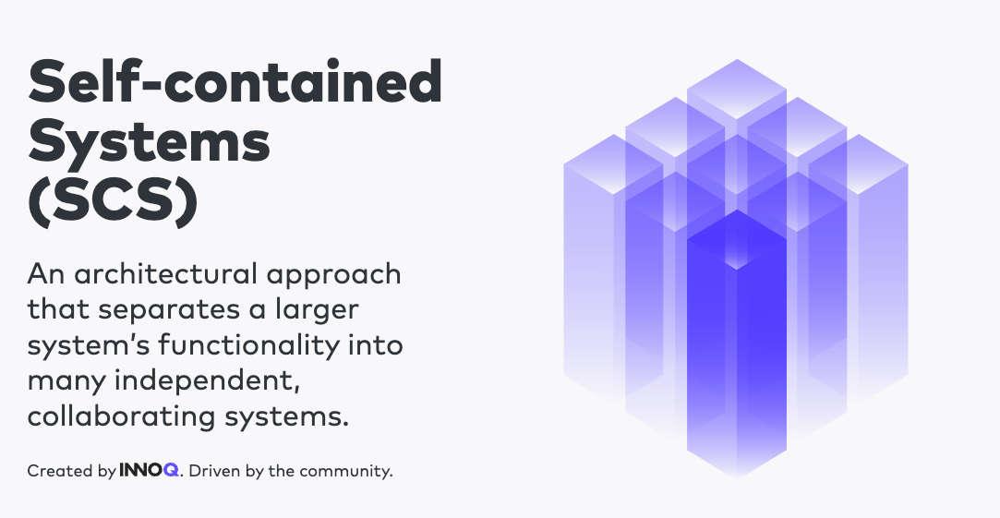
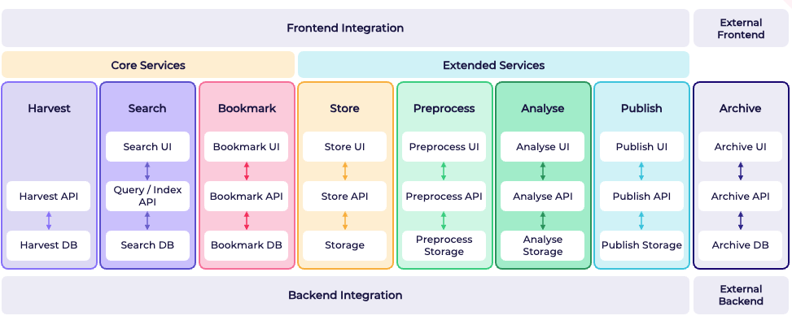
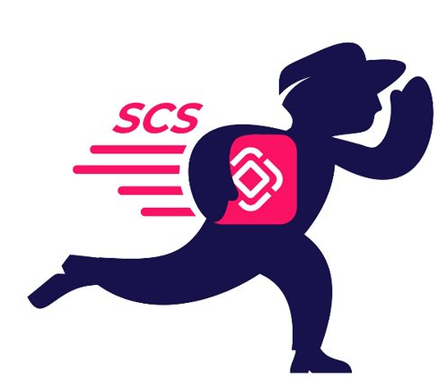
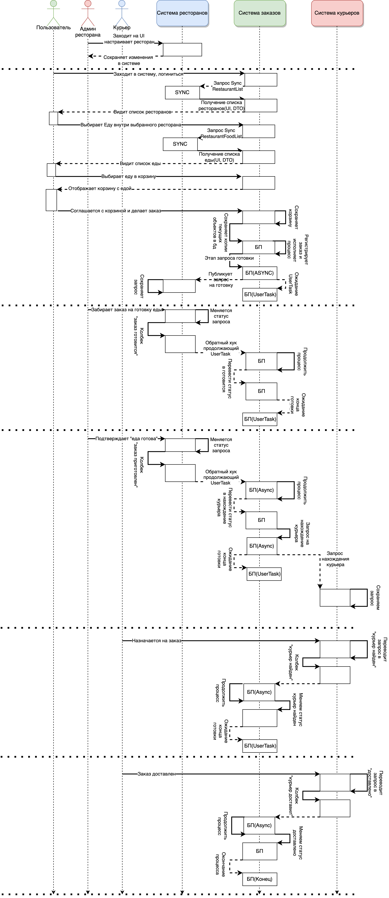
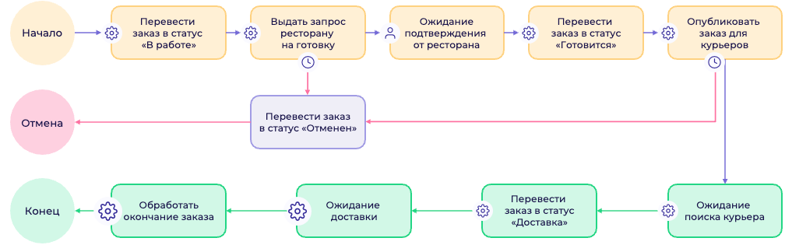
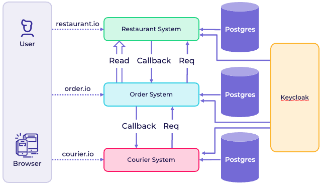

# SCS под микроскопом

Как быстро зафейлить новый проект Java? Просто взять и применить все, что ты услышал на последней Java конференции;) 
Как быстро сделать энтерпрайзный проект минимальной командой в короткие сроки? Верно - подобрать оптимальную архитектуру и правильные инструменты. 
Сегодня расскажу о компромиссном варианте между хайповыми (все еще) микросервисами и монолитами, который называется [Self-Contained Systems](https://scs-architecture.org/) 
(Отмечу, что мы будем называть их автономные системы или кратко - SCS).
Кажется, он выпьет меньше крови и сохранит ваши нервы. Ну обо всем по порядку.

Следуя из названия, принцип подхода прост - разбиваем систему по доменам, в каждой системе находится независимый монолит,
который мы стараемся максимально абстрагировать от жизни других компонентов. Надпоминает монолиты? Но не делайте поспешных выводов!

Пройдя "вьетнам" на одном проекте, который был написан по принципам, схожим с SCS, я задался вопросом, который меня толкнул на R&D
по автономным системам. Целью исследование стало более глубокое погружение в архитектурну SCS. Какой спектр задач
можешь покрыть новоявленная для меня концепция и к каким кейсам применить SCS станет для проекта идельным решением?

## Для кого этот паттерн может быть актуальным?
Очевидно, в бигтехе, по типу сбера, озона, втб и других (см. [ЯВОВА/ВОТВАСЯ](https://habr.com/ru/articles/586426/)) 
все архитектры будут воротить нос, как только услышат слово монолит. Так что в первую очередь, SCS предназначен для команд
средних размеров, занимающихся какими то E-commerce решениями. Так же, 

## Как я узнал о SCS
Не так давно я услышал от коллег об одном интересном архитектурном подходе, таком как Self-Contained Systems. Если перейти на [сайт](https://scs-architecture.org/),
то не сразу становится очевидно, в чем философия подхода и что вообще происходит, потому сперва давайте поговорим, к чему мы придем.
Целью будет погружение в SCS как архитектруного подхода и написанию правдеподобного демо проекта.

**Self Contained Systems – ключ к модульной архитектуре**
В мире современной разработки программного обеспечения растет потребность в модульности и расширяемости систем. Такой подход позволяет командам разработчиков оперативно вносить изменения в одну часть продукта, не влияя на работу других. В этом контексте получили развитие так называемые Self Contained Systems (SCS), или самодостаточные системы, которые можно рассматривать как ответ на эти вызовы.
### Что такое Self Contained Systems?
Self Contained Systems — это независимые, самодостаточные модули, каждый из которых представляет собой отдельную часть функциональности в рамках большого программного продукта.
Ключевой особенностью таких систем является то, что они реализуют специфический бизнес-процесс или набор связанных функций и обладают всем необходимым для их работы: кодом, данными, конфигурацией и зависимостями.
При этом каждая SCS может быть разработана, развернута, заменена или удалена независимо от остальных частей большой системы.

В первую очередь, я бы сказал, что автономные системы это "сообщающиеся монолиты" с некоторомым количеством "но" заимствованных из микросервисов.
Если более развернуто, то автономные системы - это набор монолитов, написанных в SOA стиле и разбитых по доменам, где общая картина системы - минимальная связанность и
отказоустойчивые межсистемные комуникации.
Давайте погрузимся в философию Self Contained Systems и рассмотрим,
как этот архитектурный паттерн изменяет наше понимание построения программных решений, отвечая вызовам современного мира разработки.

### Innoq
Если перейти по ссылке, можно почитать про успешный успех того, как Innoq стоит свою E-Commerce систему 
на базе архитектуры Self-Contained Systems, а так же предоставляют примерный вид того, как выгляди их пример, представленная ниже.

Как мы можем наблюдать - каждая из система - это набор монолитов, разбитых на поддомены. Выше есть общая система, которая собирает все разрозненные UI
вместе. Чтобы лучше прочувствовать разницу между SOA и микросервисами, я добавил картинку ниже, 
демонстрирующую разницу в этих подходах.

## Философия Self-Contained Systems!

В мире архитектурных паттернов существует постоянная потребность в поиске оптимальных решений для создания устойчивых и гибких систем.
Философия Self Contained Systems (Системы, Самодостаточные и Замкнутые) предоставляет ценные принципы, согласно сообществу и INNOQ, описанные на официальном сайте данной архитектуры.

### Основные принципы:
* **Доменное разбиение**: Важнейшей составляющей SCS является разбиение системы на домены. Каждый домен представляет собой независимую подсистему, сосредотачивающуюся на своей области ответственности.
* **Сосредоточенность на домене**: Желательно, чтобы каждая система не выностила и не превностила свои внутренние объекты за границы ответственности своей же области.
* **Минимизация оверхеда**Каждая подсистема должны выглядеть как микросервис с архитектурной точки зрения.
* **Сервисность**: Допускается использование микросервисов для решения доменной бизнес логики (для одной системы использование 1-n микросервисов в бекенде).
* **Отдельная база данных**: Каждая система, подобно микросервисам, обязана иметь свою собственную базу данных.
* **Технологическая свобода**: Отсутствие ограничений в выборе технологий позволяет адаптировать подход к конкретным потребностям проекта.
* **Асинхронные коммуникации**: Коммуникации между системами должны быть асинхронными. Это обеспечивает более эффективное взаимодействие и гибкость. Межсистемные комуникации должны использовать HTTP Rest или легковесный брокер сообщений
* **Сосредоточенность команд**: Одна команда может работать над одной или несколькими подсистемами. Над одной подсистемой может работать ТОЛЬКО одна команда.
* **Минимизация связности**: Уровень связности между системами должен быть минимальным, обеспечивая тем самым легкость поддержки и модификации.
* **Переиспользуемость**: Над всеми системами существуют проект или проекты, вобравшие в себя все общие между системами. Общие UI компоненты, общие сущности и DTO, респространение API подсистем, которые вынесены наружу,
общие вычисления, подходы. Пример - общий Oidc плагин для работы с Keycloak.
* **Отдельный UI**: Каждая система имеет свой собстенный UI, который должен синергировать по стилю с другими системами. Синегрия должна достигаться по средствам общего UI Toolkit
* **Слияние**: Все подсистемы с точки зрения UI/UX должны выглядеть как одно целое, а излишние сообщения между системами уменьшаться по средствам использования Web интерфейсов, таких как hyperlink, iframe и те.
* **Обобщенный UI**При использовании iframe должен быть root-layout система, которая объединяет все подсистемы UI.
* **Связанный UI**:При использовании hyperlink-ов, они обязаны работать в ОБЕ стороны.

### Ключевые аспекты философии:
   **Доменное разбиение как основной столп SCS**
   Первый и наиболее важный аспект — логическое разбиение системы на домены. В зависимости от области, где функционирует система, SCS может принимать различные формы.
Соблюдение указанных выше принципов рекомендуется, но также зависит от конкретной доменной области.
Автономность систем и подход к коммуникациям.
   **Автономность систем и подход к коммуникациям**
   Второй аспект подчеркивает, что автономные системы, вроде SCS, являются решением для бизнес-задач, но не всегда обязательным.
Разбивка монолита на новые архитектурные подходы следует внимательно взвешивать, принимая во внимание потребности конкретного проекта. Из этого же вытекает и проблема комуникаций: как бы не топило комьюнити за асинхронные комуникации, это не всегда доступно или целесообразно.
В моем демо не будет асинхронных комуникаций, далее объясню почему, пока скажу, что такая уж доменная область. А если так сильно стоит боком асинхронные комуникации, то лучше воспользоваться брокером сообщений,
ведь подход говорит об асинхронных комуникациях, скорее как о стабильных и не падающих, обеспечивающих бизнес отказоустойчивостью. Все просто. Каждая комуникация должна быть тчательно спроектирована и давать все гарантии, которые
накладывет на нее бизнес(Отказоустойчивость, пропускная способность, летанси и те)
   **Связность и использование iframe**
   Третий аспект касается связности между системами, UI и применения iframe. В зависимости от требований проекта, системы могут содержать разное количество iframe или вовсе обходиться без них.
То же касается и общего UI Toolkit, Root layout service и других пунктов, связных с UI. Глваное - в автономных системах проектирование UX/UI будет чуть ли не более сложной задачей, чем проектирование
комуникаций.
   **Использование фреймворков**
   Так как мы используем наши любимые фреймворки в построении подсистем, то у нас есть доступ к всем их плюшкам. Однако, отсюда и вытекает один интересный момент, что при использовании монолитных фреймворков,
   вас поощрают за написание сложных систем со сложной бизнес логикой, в следствие чего, отдельная система редко получается дейстительно по размерах подходящей к термину "микро" сервис.

### Плюсы, минусы и цели архитектуры
Предлагаю подискутироваПриглашаю к обсуждению темы, в рамках которой мы рассмотрим преимущества,
недостатки и цели, которые архитектурный подход Self-Contained Systems ставит перед собой.

### Плюсы:
* **Отказоустойчивость**: Автономные системы обеспечивают устойчивость, поскольку сбои в одной системе не влияют на остальные.
* **Простое разделение по командам**: Каждая подсистема может быть независимо разрабатываемой и поддерживаемой командой, что способствует гибкости в управлении проектом.
* **Сервисная ориентированность**: SCS способствует созданию сервисно-ориентированных систем, где каждая часть выполняет конкретные функции.
* **Преимущества монолитов**: Архитектура сохраняет выгоды монолитов, такие как скорость разработки, возможность использования любимых фреймворков, а также наличие собственного UI и базы данных.
* **Независимый деплой**: Возможность обновлять и масштабировать каждую подсистему независимо, что упрощает управление версиями и обеспечивает гибкость в развертывании.
* **Предпочтительное решение для энтерпрайза**: В некоторых случаях SCS может представлять собой лучшее решение для энтерпрайза, чем микросервисы, благодаря более простому управлению и большей схожести с монолитами.

### Минусы
* **Разделенный UI**: Необходимость долгого проектирования коммуникаций и пользовательского интерфейса между автономными подсистемами.
* **Усложненные коммуникации**: В сравнении с монолитом требуется более тщательное проектирование и внимание к взаимодействию между системами.
* **Усложненный деплой**: Процессы развертывания становятся более сложными по сравнению с монолитной архитектурой.
* **Дополнительная документация и взаимодействие команд**: Вводится дополнительная необходимость в документировании и согласовании работы между различными командами, что может потребовать дополнительных ресурсов.
* **UI Toolkit**: Необходимость выделения времени на согласование общего набора инструментов для пользовательского интерфейса.
* **Невозможность ускорения UI**: В отличие от выноса бизнес-логики, ускорение пользовательского интерфейса может оказаться более сложной и дорогостоящей задачей.

Однако все эти недостатки могут быть менее релевантными для B2B и E-Commerce систем, где количество пользователей вторично по сравнению с множеством бизнес-процессов и объемом бизнес-логики.

## Исследование и Выбор Темы: Погружение в Self-Contained Systems
Мое путешествие в мир Self-Contained Systems (Системы, Самодостаточные и Замкнутые) началось с осознания необходимости глубже понять этот архитектурный подход.
Именно в этот момент, когда стандартные концепции казались недостаточными, я принял решение провести более детальное исследование.

Передо мной возник выбор объектных областей, в которых я мог бы реализовать демонстрационный проект по архитектуре Self-Contained Systems.
Среди вариантов были Клиника для животных, Онлайн Магазин, Клауд-Платформа для разработки и другие. Однако, увлекательность и актуальность предметной области Доставки еды привлекли мое внимание.
Эта сфера не только предоставляла широкий спектр бизнес-процессов, но и была близка к повседневной реальности аудитории.

## Преимущества Выбранной Темы: Близость к Реальности и Интерес

Выбор темы доставки еды для демо-проекта Self-Contained Systems был обусловлен несколькими ключевыми факторами, делающими этот наиболее выгодным.
Прежде всего, актуальность и повседневная близость данной темы к жизни людей придают проекту живой контекст и делают его ближе к реальным потребностям пользователей. Если вы не согласны, пишите в
коментарии другую тему, возможно я ее выберу и напишу еще SCS на рельсах).
Далее - благодаря разнообразию бизнес-процессов в сфере доставки еды, проект получает возможность исследования и моделирования множества сценариев, начиная от размещения заказа и готовки блюда до самой доставки и оплаты.
Это предоставляет разработчику уникальную возможность создавать автономные системы, каждая из которых фокусируется на определенном этапе бизнес-процесса.
Выбор доставки еды также обеспечивает легкость восприятия проекта широкой аудиторией, так как данная тема понятна большинству людей.
Итак, выбор темы доставки является оптимальным для демо.

## Разработка Концепции: От Идеи к Реальности
С момента выбора темы доставки еды, я начал систематическое исследование бизнес-процессов в данной отрасли.
Анализируя каждый этап – от размещения заказа до его доставки, я выявил ключевые поинты, по которым можно построить достаку еду по философии SCS.
Каждая подсистема внутри демо-проекта могла бы сосредотачиваться на конкретном домене доставки еды.

## Домены внутри доставки еды
### Ресторан (Restaurant System):
В этом домене фокусируется вся информация о ресторанах.
Здесь осуществляется регистрация и создание новых ресторанов.
Администраторы ресторанов имеют возможность настраивать меню, добавлять и редактировать блюда, а также принимать заказы на готовку еды.
Этот домен является ключевым для организации бизнес-процесса внутри ресторанов.

### Доставка (Delivery):
Домен доставки фокусируется на управлении курьерами. Здесь происходит регистрация курьеров, назначение им роли доставщика, а также менеджмент заказов, связанных с доставкой.
В этом домене осуществляется эффективное управление логистикой и выполнением заказов.

### Заказы (Order System):
Центральным доменом в системе доставки еды является система заказов. Здесь пользователи начинают бизнес-процесс, создавая заказы.
Интерфейс для создания заказов, наполнение корзины и все запросы, связанные с бизнес-процессом доставки еды, исходят именно из этого домена.
Здесь происходит взаимодействие с другими подсистемами и интеграции для эффективного выполнения заказов.

### Важные Замечания:
В реальной системе также должны существовать дополнительные домены, хотя их не будет в нашем проекте.
Эти домены включают систему платежей, уведомлений, построения маршрутов доставки и триггеров геолокации.
Они представляют собой важные аспекты реальной системы, но в рамках демонстрации SCS мы упростим структуру и сфокусируемся на интеграциях между основными подсистемами.

Перед проведением демо Self-Contained Systems мы приняли решение упростить некоторые аспекты бизнес-процесса доставки еды.
Мы не будем рассматривать сложные сценарии, такие как оплата и отмена заказов, чтобы минимизировать сложность написания кода и ускорить прототипирование проекта.
Роли будут минимальными для удобства работы, и мы учтем другие аспекты, которые упростят и ускорят процесс написания доставки еды.
Наша основная цель - продемонстрировать эффективные интеграции между различными подсистемами.

## Итак, погнали

## План
Перед тем, как преступить к демо, поставим шаги которые мы будем делать
1. Напишем Flow-диаграмму и архитектуру того, что будет происходить в проекте
2. По диаграмме определимся с технологическим стеком
3. По шагам (по каждой системе)  будем собирать мозайку
4. Переход к демо

## Архитектура
Итак, у нас 3 подсистемы и 3 вида пользователей. 
### Системы: 
* **Заказов**(Order System) -> пользователь
* **Курьеров**(Courier System -> курьер
* **Ресторанов**(Restaurant System) -> администратор ресторанов

### Пользователи и тех. решение
1. Именно в данной объектной области, сквозные роли будет классным решением. Базово - в системе заказов, очевидно, каждый кто заходит,
может сделать заказ, однако, с технической точки зрения, какой-нибудь админ ресторана, зайтя в эту систему, может иметь ссылки на свою же еду. Так, мы можем не 
копировать роли, а использовать одну и ту же для упрощения взаимных ссылок и контента. Однако, в большинство других объектных областей 
сквозная ролевая система плохо ложиться, стоит это иметь ввиду.
2. Чтобы попасть в другие системы, пользователь должен иметь соответствующие роли. Однако, для упрощения, у нас будет одна единственная роль и
мы устно проговорили, что чтобы попасть в другие системы, пользователь "имеет" и другие пермишены данные ролями.

## Flow-диаграмма и BPMN
Ниже представлена Flow диаграма того, что будет происходить в системе. Стоит сделать отступление, что будет еще 1 шаг, который мы опустим. Это шаг
самой физической доставки курьером от точки А до точки Б. Вместо этого мы просто подождем 10 секунд и сразу поменяетм статус заказа 
на доставлен.

Я не фанат нагружать архитектурным трепом людей, потому предлагаю написать вместо Flow-диаграмы более высокоуровневую
bpmn диаграму, котомую мы и будем использовать в проекте.

Куда более понятно, что будет происходить. 

## Выбор технологий.
Так как SCS это технология, использующаяся в энтерпрайсе, то и язык надо выбрать соответствующий. 
Остановимся на Java и SpringBoot. Однако, нам нужен монолит, потому предлагается выбрать такой прекрасный фреймворк, как Jmix,
у которого есть современный UI и необходимый нам движок Bpmn из коробки. Flowable к тому же даст нам необходиму асинхронность и отказоустойчивость,
так необходимую бизнесу.
Еще нам надо как то хранить пользователей между системами. Потому еще мы будем использовать Keycloak как самый простой
способ расшарить пользователей между системаи и иметь одну единственную точку изменений пользователей.
Итак, у нас в проекте используются следующие технологии:
* Jmix FlowUI 
  * Spring Boot 3
  * VAADIN 24 (Vaadin Flow)
* Keycloak
* Flowable (как Bpmn 2.0 движок для бизнес процессов)

### UI и как мы будем разделять UI
Так как у нас 3 системы, которые вообще почти друг с другом не связанны, мы не будем использовать
Frame или ссылки просто потому что у нас нет такой необходимости. Все 3 системы весьма хорошо и независимо работают друг без друга.
Потому нам не нужна отдельная система, которая будет являтся root системой всех подсистем, из которой мы будем
iframe-ами отображать контент подсистем.

### Архитектура комуникаций 

В данном примере мы не будем усложнять пример, заодно покажем, что устойчивая система не всегда нуждается в
асинхронных и/или реактивных комуникациях.
1. Когда пользователь заходит на заказ, мы ему будем отображать все те DTO, что пришли из 
ресторанов, тем самым гарантируя, что до старта процесса и создания картины, мы никак не вмешиваемся к консистентность данных.
По контракту после того, как пользователь запросил список еды и до конца, цены не будут изменяться.
Сам запрос в начале процесса, когда пользователь еще не создал корзину, нам не нужны не блокирующие асинхронные запросы, потому как 
пользователю не на что будет смотреть и ему в любом случае надо хдать, пока данные придут и отрисуются элементы меню.
2. Когда пользователь будет создавать заказ, мы будем сохранять копии того, что выбрал себе пользователь. Тем самым мы себе гарантируем,
что при модификации или удалении элементов из меню ресторана на заказ это никак не повлияет. 
3. Все комуникации остануться внутри процесса. Так как мы будем писать процесс по средствам Bpmn 2.0 и на движке Flowable,
то запросы мы будем отправлять асинхронно.
4. В нашем случае мы реализуем паттер Request-Wait-ResponseAfter через Flowable.
   * Асинхронно пускаем запрос в другую систему внутри отдельной задачи в бизнес процессе.
   * Далее останавливаем процесс на задаче для пользователя. Так мы будем ждать любое количество времени
   подтверждения продолжения процесса из другой системы
  * Когда приходит ответ от другой системы мы продолжаем пользовательсукую задачу и процесс идет далее.
Данным подходе мы решаем большинство проблем как с устойчивостью, так и минимизацией межсистемных комуникаций.

## Каркас проекта и плагины

### Архиподобная текстура
### 

## Настойка Keycloak

## Написание Restaurant System

###

## Написание Order System

