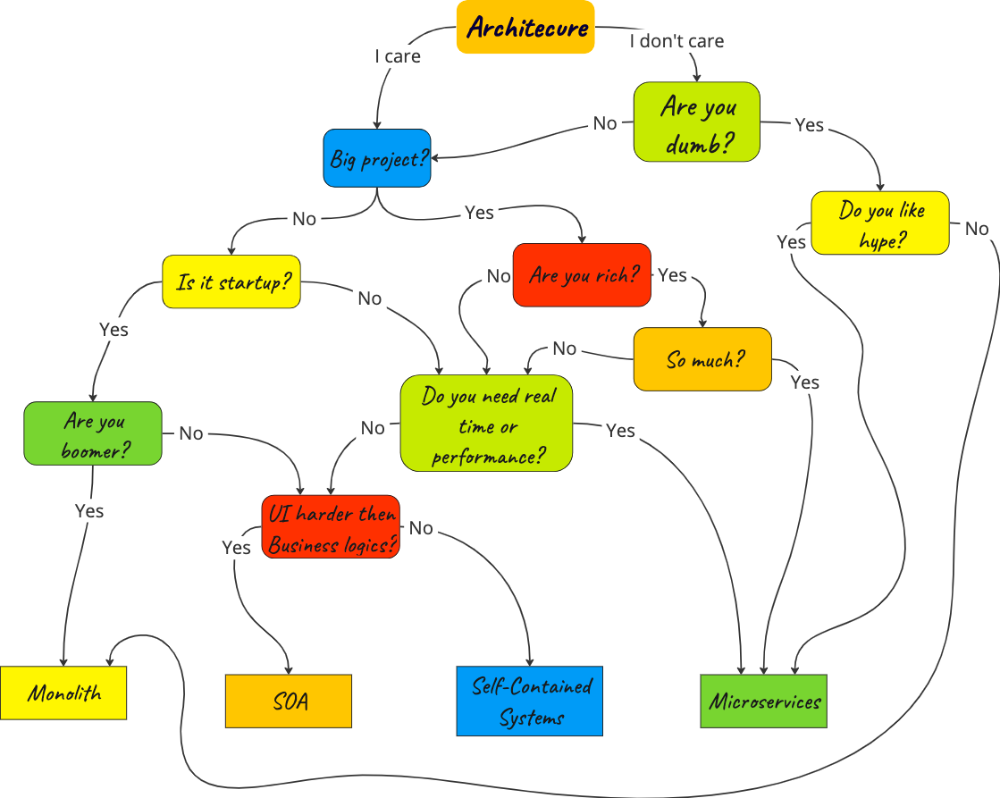
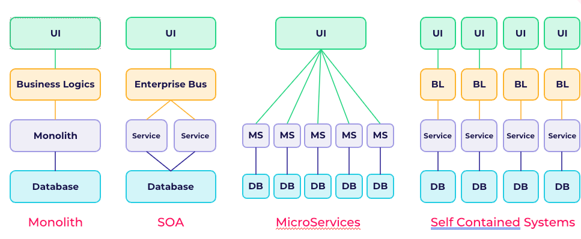
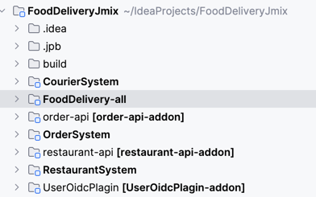

# Self-Contained Systems под микроскопом

Как быстро зафейлить новый проект Java? Просто взять и применить все, что ты услышал на последней Java конференции;) 
Как быстро сделать энтерпрайзный проект минимальной командой в короткие сроки? Верно - подобрать оптимальную архитектуру и правильные инструменты. 
Сегодня расскажу о компромиссном варианте между хайповыми (все еще) **микросервисами** и **монолитами**, который называется [Self-Contained Systems](https://scs-architecture.org/)
Кажется, он выпьет меньше крови и сохранит ваши нервы. Ну обо всем по порядку.

Отмечу, что **Self-Contained Systems** мы будем называть их автономные системы или кратко - SCS.


Следуя из названия, принцип подхода прост - **разбиваем систему по доменам**, в каждом домене находится независимый монолит(система).
Стараемся максимально не допускать связность между подсистемами.
Надпоминает микросервисы?
Но не делайте поспешных выводов!

Пройдя "вьетнам" на одном энтерпрайс проекте с SCS подобной архитектурой, я захотел сделать R&D по автономным системам.
Хотелось бы поделиться опытом исследований и рассказать как готовить SCS. 
Какой спектр задач может покрыть новоявленная концепция и к каким кейсам применить SCS станет для проекта идеальным решением?

## Для кого это может быть актуально?
Очевидно, в бигтехе, по типу сбера, озона, втб и других явова (см. [ЯВОВА/ВОТВАСЯ](https://habr.com/ru/articles/586426/)) 
все архитекторы будут воротить нос, как только услышат слово монолит. 

**В первую очередь**, SCS, как и сама статья будет интересна людям, занимающимся **E-commerce** приложениями. 
Насмотревшись на кровавый энтерпрейс, могу сказать, если у вас скудный ресурс, а система большая, то SCS может стать целебной таблеткой, решающей 
многие проблемы среднестатистического проекта.
**Вторая часть аудитории** - люди, использующие современные фуллстак фреймворки. 
Я как разработчик фреймворка `Jmix`, а так же любитель `Ruby on Rails`, могу сказать, что написание SCS будет для вас занимательным опытом(ну или хотя бы прочтение данной статьи).

## Как я узнал о SCS
Как-то на одном из дейликов или планерок, мы с коллегами <s>подняли срач</s> дискутировали на тему **таргет аудитории** Jmix, 
можно ли написать огромный маркетплейс без колоссальных усилий на платформе?
А так как я уже знал ответ на этот вопрос, так как прошел медные трубы в кровавом энтерпрайсе, у меня возникла мысль
написать **демо-проект**, который будет неким стендом, **чего можно добиться используя монолиты в 24 году** (_куда большего,
чем вы могли бы представить_).

## **Self Contained Systems – ключ к модульной архитектуре**
Индикатор того, что **ваш проект будет хорошо ложиться на SCS** - **больше количество доменов, бизнес логики и логики заполнения форм**.
Узнали? Это же наш (не)любимый энтерпрайс. **Главный плюс**, который проект получает при разделении на автономные системы - это
_"микросервисные монолиты"_. В таком подходе мы имеем **повышенную устойчивость**, **деплой** и другие плюшки, о которых я расскажу далее.


### Детальное погружение

_Если говорить ~~душно~~ более научно, `Self Contained Systems` — это независимые, самодостаточные системы(подсистемы), 
каждый из которых представляет собой отдельную часть функциональности в рамках большого программного продукта._

Перейдем на простонародный язык.
**Автономные системы** это "_сообщающиеся монолиты_" с некоторым количеством "_но_"заимствованных из микросервисов.
**SCS** - это набор монолитов, написанных в SOA стиле и разбитых по доменам с минимальной связанность и
отказоустойчивыми межсистемными коммуникациями.

Ключевой особенностью таких систем является то, что **они реализуют специфический бизнес-процесс или набор связанных
функций** и обладают всем необходимым для их работы: кодом, данными, конфигурацией и зависимостями.
При этом каждая система **минимально связана**, может быть разработана, развернута, заменена или **удалена независимо** от остальных частей большой
системы.

### Когда не стоит смотреть в сторону SCS?
Ну... Если у вас **большая нагрузка** (в основном это касается UI), сложный UI, который проще написать на современных
фронтенд фреймворках с использованием SOA/микросервисов. В общем, если у вас не стандартный UI - вы можете наесться "_проблем_".
Если в проекте **какие-то вычисления** или **риал-тайм данные**, проще будет сразу писать микросервисы. 
**Итого**: все перечисленные выше проблемы обычно не касаются энтерпрайса.

### У самурая нет ~~плана~~ архитектуры - есть только ~~путь~~ задачи
В **правильных руках** и монолит может стать крайне эффективной архитектурой(см. GitHub, GitLab, Shopify).
Не относитесь к статье как к постулатам. Зачастую, **выбор архитектуры может быть делом вкуса и скиллов команды.**

### Innoq
**Innoq** - пожалуй, самый большой мейинейнер в комьюнити SCS.
Если перейти по [ссылке](https://www.innoq.com/en/cases/best-in-industry-e-commerce-plattform-fuer-elektronikkomponenten/),
можно почитать историю об успешном успехе Innoq, построившие свою _E-Commerce систему_ на базе Self-Contained Systems.
Скриншот ниже, взятый с сайта Innoq, примерно знакомит нас с архитектурой SCS. 


Как мы можем наблюдать, каждая из подсистем innoq - это набор монолитов, разбитых на домены.
Подмечу, есть общая система, которая собирает все разрозненные элементы UI вместе.

Чтобы лучше прочувствовать разницу между SOA и микросервисами, я добавил картинку ниже,
демонстрирующую разницу в этих подходах.




## Философия Self-Contained Systems!


Сообщество энтузиастов сформулировали некоторое количество **принципов**, следуя которым, можно написать **хорошую
систему**, построенную на SCS. _На самом сайте SCS про них можно детально почитать_. 

### Основные принципы:
**Ниже находится пересказ всех поинтов, описанных комьюнити и Innoq**. 

_От себя добавил некоторые недосказанные поинты, а где-то добавил комментарии.
Здесь не будет никаких искажений оригинала, лишь объяснения. 
Мое мнение о работе SCS в реальном мире я выскажу чуть позже._

* **Доменное разбиение**: Важнейшей составляющей SCS является разбиение системы на домены. Каждый _домен представляет
  собой независимую подсистему_, сосредотачивающуюся на своей области ответственности.
* **Сосредоточенность на домене**: Желательно, чтобы каждая система не выносила и не привносила свои внутренние
  объекты за границы ответственности своей же области.
* **Минимизация оверхеда**: Каждая _подсистема должны выглядеть как микросервис_ с архитектурной точки зрения.
* **Сервисность**: Допускается использование `микросервисов` для решения `доменной бизнес логики` (для одной системы
  использование n микросервисов в бекенде).
* **Отдельная база данных**: Каждая система, подобно микросервисам, обязана иметь свою собственную базу данных.
* **Технологическая свобода**: Отсутствие ограничений в выборе технологий позволяет адаптировать подход к конкретным
  потребностям проекта.
* **Асинхронные коммуникации**: Коммуникации между системами должны быть `асинхронными`. Это обеспечивает более
  эффективное взаимодействие и гибкость. Межсистемные коммуникации должны использовать `HTTP Rest` или `легковесный брокер`
  сообщений.
* **Сосредоточенность команд**: Одна команда может работать над одной или несколькими подсистемами. Над одной
  подсистемой может работать ТОЛЬКО одна команда.
* **Минимизация связности**: Уровень связности между системами должен быть минимальным, обеспечивая тем самым легкость
  поддержки и модификации.
* **Переиспользуемость**: Над всеми системами существуют проект или проекты, вобравшие в себя все общие от систем.
  Общие UI компоненты, общие сущности и DTO, API подсистем, которые вынесены наружу,
  общие вычисления, подходы. _Пример - общий Oidc плагин для работы с Keycloak_.
* **Отдельный UI**: Каждая система имеет свой собственный UI, который должен синергировать по стилю с другими системами.
  Синергия должна достигаться по средствам общего `UI Toolkit`.
* **Слияние**: Все подсистемы с точки зрения `UI/UX` должны выглядеть как одно целое. Излишние сообщения между системами
  должны уменьшаться по средствам использования `Web интерфейсов`, таких как `hyperlink`, `iframe` и те.
* **Обобщенный UI**: При использовании `iframe` должен быть `root-layout система`, которая объединяет все подсистемы в один UI.
* **Связанный UI**:При использовании hyperlink-ов, они обязаны работать в ОБЕ стороны.

### Ключевые аспекты философии:
_Ниже комментарии, которые пояснят некоторую недосказанность философии Self-Contained Systems._

* **Логическое разбиение системы на домены** <br/>
    В зависимости от области, где функционирует система, **SCS может принимать различные формы**.
    Соблюдение указанных выше принципов **рекомендуется**, но также зависит от конкретной доменной области.

* **Автономность систем и подход к коммуникациям**. <br/>
    При переходе от общего к частному следует **внимательно** взвешивать, принимая во внимание **потребности
    конкретного проекта**. Проблема коммуникаций: как бы ни топило комьюнити за асинхронные коммуникации,
    **это не всегда доступно или целесообразно**.
    Например, в моем демо не было **явных** асинхронных коммуникаций.
    Такая уж доменная область. 
    Если так сильно хочется асинхронные коммуникации, то лучше воспользоваться **брокером сообщений**.

* **Связность и использование iframe**. <br/>
    Третий аспект касается связности между системами, UI и **применения iframe**. В зависимости от требований проекта, системы
    могут содержать **разное количество iframe** или вовсе **обходиться без них**.
    То же касается и общего `UI Toolkit`, `Root layout service` и других пунктов, связных с UI. 
    **Главное** - в автономных системах вероятно **проектирование UX/UI будет более сложной задачей**, чем проектирование
    коммуникаций.

* **Использование фреймворков**. <br/>
    Так как мы используем наши любимые фреймворки в построении подсистем, то у нас есть доступ к всем их плюшкам. Однако,
    отсюда и вытекает один интересный момент, что при использовании монолитных фреймворков,
    вас поощрают за написание сложных систем со сложной бизнес логикой, вследствие чего, отдельная система редко получается
    дейстительно по размерах подходящей к термину "микро" сервис.

## Плюсы, минусы и цели архитектуры

Теперь обсудим что мы получаем, выбрав SCS. На какие грабли мы можем наступить в таком подходе?

### Плюсы:

* **Отказоустойчивость**: Автономные системы обеспечивают устойчивость, поскольку сбои в одной системе не влияют на
  остальные.
* **Простое разделение по командам**: Каждая подсистема может быть независимо разрабатываемой и поддерживаемой командой,
  что способствует гибкости в управлении проектом.
* **Сервисная ориентированность**: SCS способствует созданию сервисно-ориентированных систем, где каждая часть выполняет
  конкретные функции.
* **Преимущества монолитов**: Архитектура сохраняет выгоды монолитов, такие как скорость разработки, возможность
  использования любимых фреймворков, а также наличие фуллстек UI и ORM.
* **Независимый деплой**: Возможность обновлять и масштабировать каждую подсистему независимо, что упрощает управление
  версиями и обеспечивает гибкость в развертывании.
* **Предпочтительное решение для энтерпрайса**: В некоторых случаях SCS может представлять собой более выгодное решение для
  энтерпрайса, чем микросервисы, благодаря более простому управлению и большей схожести с монолитами.

### Минусы

* **Разделенный UI**: Необходимость долгого проектирования коммуникаций и пользовательского интерфейса между автономными
  подсистемами.
* **Усложненные коммуникации**: В сравнении с монолитом требуется более тщательное проектирование и внимание к
  взаимодействию между системами.
* **Усложненный деплой**: Процессы развертывания становятся более сложными по сравнению с монолитной архитектурой.
* **Дополнительная документация и взаимодействие команд**: Вводится дополнительная необходимость в документировании и
  согласовании работы между различными командами, что может потребовать дополнительных ресурсов.
* **UI Toolkit**: Необходимость выделения времени на согласование общего набора инструментов для пользовательского
  интерфейса.
* **Невозможность ускорения UI**: В отличие от выноса бизнес-логики, ускорение пользовательского интерфейса может
  оказаться более сложной и дорогостоящей задачей.

### Минусы в реалиях энтерпрайса

Однако все эти недостатки могут быть **менее релевантными** для **B2B** и **E-Commerce** систем, где количество пользователей
вторично по сравнению с множеством бизнес-процессов и объемом бизнес-логики.

## Выбор объектной модели из реального мира для демо

Той еще проблемой для меня стал выбор темы демо. CRM? Пэт-клиника? Онлайн магазин? Public Cloud?
Ох, вы бы знали сколько я думал над тем, что же выбрать... 
В итоге, взвесив все плюсы и минусы, я решил, что мой выбор - **доставка еды**.
Эта тема не только предоставляет широкий спектр бизнес-процессов, но и близка к повседневной реальности аудитории.
Ну кто хоть раз не пользовался доставкой еды? 
И понять легко и бизнес-процесс прозрачный и большой;)

## Разработка Концепции: От Идеи к Реальности
Раз с темой разорались, пора переходить к планированию. В выбранной области стоит выделить:
* Домены
* Сущности и отношения между ними
* Флоу\процессы
* Правила и констреинты

Далее **опустим некоторое количество правил**, которые нам будут сильно усложнять работу. Обычно такие правила являются 
жизненно важными для бизнеса, но с логической точки зрения являются **мелочами**. Например - мы не будем обрабатывать случай,
когда курьер подскользнулся на льду и расшибся:)

## Домены внутри доставки еды
Выберем 3 основных домена внутри доставки еды, без которых "_delivering_" не может работать.

### Ресторан (Restaurant System):

В этом домене фокусируется вся информация о **ресторанах**.
Здесь осуществляется **регистрация** и **создание** новых ресторанов.
Администраторы ресторанов имеют возможность **настраивать меню, добавлять и редактировать блюда**, а также **принимать заказы**
на готовку еды.
Этот домен является ключевым для организации бизнес-процесса внутри ресторанов.

### Доставка (Delivery):

Домен доставки фокусируется на **управлении курьерами**. Здесь происходит **регистрация курьеров**, назначение им роли
доставщика, а также менеджмент заказов, связанных с доставкой.
В этом домене осуществляется эффективное управление логистикой и выполнением заказов.

### Заказы (Order System):

**Центральным доменом** в системе доставки еды является **система заказов**. Здесь пользователи начинают **бизнес-процесс,
создавая заказы.**
Интерфейс для создания заказов, наполнение корзины и все запросы, связанные с бизнес-процессом доставки еды, исходят
именно из этого домена.
Здесь происходит **взаимодействие с другими подсистемами** и интеграции для эффективного выполнения заказов.

### Важное отступление перед демо:

В **реальной системе** должны существовать дополнительные домены, без которых доставка не имеет смысла.
Эти домены включают **систему платежей**, **уведомлений**, **построения маршрутов** доставки и триггеров геолокации.
Они представляют собой **важные аспекты реальной системы**, но в рамках демонстрации SCS мы **упростим структуру** и
**сфокусируемся на интеграциях** между основными подсистемами.

Перед проведением демо Self-Contained Systems я решил упростить некоторые аспекты бизнес-процесса доставки
еды.
Мы **не будем рассматривать сложные сценарии**, такие как **оплата** и **отмена заказов**, чтобы **минимизировать сложность** написания
кода и ускорить прототипирование проекта.
**Роли будут минимальными** для удобства работы, и мы учтем другие аспекты, которые упростят и ускорят процесс написания
доставки еды.
_Наша основная цель - продемонстрировать эффективные интеграции между различными подсистемами._

## Самое важно
Нам нужна иконка демо проекта!


Пожалуй, иконка проекта выбрана. А может мне стоило попросить DALL-e сгенерировать ее вместо меня...

## Проектирование

1. **Flow-диаграмма и Архитектура:** <br/>
   Начнем с создания Flow-диаграммы и определения архитектуры проекта. Это поможет нам лучше понять взаимодействие между
   системами.
2. **Выбор Технологического Стека:**<br/>
   На основе Flow-диаграммы мы определимся с технологическим стеком. Какие инструменты и языки программирования будем
   использовать.
3. **Сборка Мозаики по Шагам:**<br/>
   Пройдемся по каждой подсистеме, собирая мозаичные элементы функционала. Это позволит нам пошагово организовать каждую
   систему.
4. **Переход к Демонстрации:**<br/>
   Закончив сборку мозаики, перейдем к демонстрации работы системы.

## Архитектура

У нас есть три ключевые подсистемы и три типа пользователей.

### Подсистемы:

* **Система Заказов (Order System)**: Взаимодействие с пользователями.
* **Система Курьеров (Courier System)**: Ориентирована на курьеров.
* **Система Ресторанов (Restaurant System)**: Администрирование ресторанов.

### Пользователи и тех. решение

1. **Сквозные роли:** <br/>
   **В данной объектной области использование сквозных ролей** представляется **эффективным решением**.
   В системе заказов, каждый пользователь, заходящий в систему, способен сделать заказ.
   Однако, с технической точки зрения, администратор ресторана,
   также входящий в эту систему, может иметь ссылки на продукцию своего ресторана.
   Это позволяет **избежать дублирования ролей** и использовать единую роль для упрощения взаимных ссылок и контента.
   Стоит отметить, что в большинстве других объектных областей сквозная ролевая система может быть неудачным выбором.

2. **Роли и пермишены:**
   Для доступа к другим системам пользователь должен обладать соответствующими ролями.
   Однако, для удобства, **я решил использовать одну единственную роль**,
   предоставляя пользователю необходимые пермишены для взаимодействия с другими системами.
   Это решение сокращает количество ролей, **упрощая дальнейшую разработку демо проекта**.

## Flow-диаграмма и BPMN

Ниже представлена **Flow-диаграмма** того, что будет происходить в системе.
Да. Она немножечко страшная;) А вы видели простые Flow-диаграммы?

Стоит сделать отступление, что будет еще **один шаг**, который мы **опустим**.
Это шаг самой **физической доставки курьером** от точки А до точки Б.
Вместо этого мы просто подождем 10 секунд и сразу поменяем статус заказа на "доставлен".
<details>
  <summary>Flow Diagram</summary>


</details>
<br/>
Для **более наглядного представления** мы решили вместо Flow-диаграммы использовать более высокоуровневую BPMN-диаграмму,
которую мы будем использовать в рамках проекта.
<br/>
<br/>
<details>
  <summary>Bpmn notation</summary>


</details>

Это более интуитивное представление процесса. В общих чертах, мы создали простой сценарий:

1. **Пользователь заходит в систему заказов.**
   Система заказов загружает список ресторанов из системы ресторанов (какая тавтология).
2. **Пользователь выбирает ресторан.**
   Система загружает из системы ресторанов список еды и меню для пользователя. Пользователь составляет корзину из
   предложенного и сохраняет заказ.
3. **Система заказов сохраняет копии заказа пользователя и запускает бизнес-процесс.**
4. **Система заказов делает HTTP-запрос в систему ресторанов с запросом на готовку еды.**
   Процесс останавливается и ожидает, пока ресторан подтвердит.
5. **Админ ресторана заходит в систему (ресторанов), берет заказ на приготовление еды.**
   Система ресторанов делает обратный HTTP-запрос в систему доставки еды. Система заказов продолжает бизнес-процесс.
6. **Система заказов делает HTTP-запрос в систему ресторанов курьеров и публикует запрос на доставку.**
7. **Курьер заходит в систему доставки, берет на себя текущий заказ.**
   Система курьеров делает обратный HTTP-запрос в систему заказов, продолжается бизнес-процесс.
8. **Начинается доставка.**
   Здесь мы имитируем доставку и другие элементы путем ожидания 10 секунд. Этот этап пустой. Затем бизнес-процесс
   приостанавливается, ожидая завершения доставки.
9. **Курьер доставил еду.**
   Заходит в систему и подтверждает окончание доставки. Система курьеров делает обратный HTTP-запрос в систему заказов.
   Бизнес-процесс продолжается.
10. **Финальный шаг.**
    Заказ переводится в статус "доставлен", и бизнес-процесс завершается.

### UI и принципы разделения по доменам

Учитывая полную автономию и независимость наших трех систем,
**мы избегаем использования фреймов или ссылок**,
так как нет необходимости в установлении жестких связей между ними.
Каждая из трех систем эффективно функционирует независимо от других.

Из-за высокой степени автономии между системами,
**нам не требуется создавать отдельную систему**,
которая бы служила корневой для всех подсистем и
предоставляла бы контент в виде iframe-ов для каждой из них.
Вместо этого мы предпочитаем поддерживать
независимость каждой системы, не нарушая ее автономии.

Такой подход дает нам гибкость и свободу в разработке каждой подсистемы,
а также упрощает управление и поддержку проекта в целом,
поскольку каждая система может эффективно разрабатываться и
внедряться независимо от остальных.

## Выбор технологий

При выборе технологий для реализации архитектурного паттерна Self-Contained Systems (SCS)
в энтерпрайз-проекте, важно учесть не только функциональные требования,
но и особенности среды. В данном случае, мы остановились на языке программирования Java и фреймворке SpringBoot.
Особое внимание уделяется выбору фреймворка для построения монолитной архитектуры,
и здесь Jmix выступает в роли идеального инструмента.
С его помощью мы получаем не только современный UI, но и встроенный движок Bpmn,
что важно для обеспечения потребностей бизнес-процессов.
Дополнительно, Flowable используется в качестве Bpmn 2.0 движка,
предоставляя необходимую асинхронность и отказоустойчивость,
что является критическими компонентами для успешной работы в корпоративной среде.
В контексте управления пользователями между системами было принято решение использовать Keycloak.
Этот выбор обусловлен не только простотой интеграции,
но и созданием единой точки управления пользователями, что обеспечивает удобство и единообразие.

#### Итак, технологический стек нашего проекта включает в себя:

- Jmix FlowUI:
    - Spring Boot 3
    - VAADIN 24 (Vaadin Flow)
- Keycloak
- Flowable (в роли Bpmn 2.0 движка для бизнес-процессов)

### Архитектура коммуникаций


В данном примере мы сознательно упрощаем сценарий, демонстрируя, 
что для построения устойчивой системы не всегда необходимо использовать
`асинхронные` и/или `реактивные` методы коммуникации.

1. При посещении пользователем страницы заказа мы предоставляем ему все объекты передачи данных (`DTO`), 
полученные из ресторанов. Это гарантирует, что до начала процесса и формирования заказа 
мы не вмешиваемся в консистентность данных. Согласно контракту, установленному до момента запроса списка блюд 
и до его завершения, цены не будут изменяться. В начале процесса, когда пользователь еще не создал корзину.
Следовательно, неблокирующие асинхронные запросы не требуются, 
поскольку у пользователя нет объектов для просмотра, и он все равно должен ожидать загрузки данных и 
отображения элементов меню.

2. При создании заказа пользователем мы сохраняем копии выбранных им блюд, обеспечивая, 
таким образом, надежность в случае изменения или удаления элементов из меню ресторана.

3. Все взаимодействия остаются внутри процесса. 
С учетом того, что мы пишем процесс с использованием Bpmn 2.0 и движка Flowable,
запросы будут отправляться асинхронно.

4. Мы реализуем паттерн "Request-Wait-ResponseAfter" через Flowable:
    - Асинхронно отправляем запрос в другую систему в рамках отдельной задачи в бизнес-процессе.
    - Затем останавливаем процесс на задаче для пользователя, ожидая подтверждения продолжения процесса из другой системы.

При получении ответа от другой системы мы возобновляем пользовательскую задачу, и процесс продолжает свой ход. 
Этот подход решает множество проблем, связанных как с устойчивостью, так и с минимизацией межсистемных коммуникаций.

## Каркас проекта и плагины

У нас есть несколько способов организовать проект. 
Первое - под каждый проект свой репозиторий, однако, тк я один разрабатывают, он мне будет много мешаться, потому, предлагаю 
остановиться на модульности или монорепозиториях. К счастью, в Jmix есть композитные проекты. Ими и воспользуемся.
<br/>

<br/>
Дам комментарии. 
1. `Кебаб кейсом` написаны плагины(модули) которые мы будем подключать к другим проектам. 
    - `order-api-addon` является модулем, содержащем внешний api заказов (только DTO).
    - `restaurant-api-addon` является модулем, содержащем внешний api (только DTO).
    - `UserOidcPlagin-addon` очевидно, будет содержать не только общий api, но и набор предопределенных абстракций и реализаций,
    которые помогут работать с KeyCloak. Потому он написан паскаль кейсом и оканчивается кебабом, чтобы надпомнить что это рантайм и аддон.
2. `CourierSystem`, `OrderSystem` и `RestaurantSystem` - Jmix(Spring Boot) приложения, у которых есть свой рантайм. По названиям, думаю очевидно, что это и есть подсистемы.
3. `FoodDelivery-all` - корневая папка, root проект для [Jmix Composite Project](https://docs.jmix.io/jmix/studio/composite-projects.html).

## Настойка Keycloak

Так как Keycloak везде разный, сетап самого KeyCloak лучше напишу словами, буду косплеить ChatGPT. 

Для тех, кто хорошо знаком с настройкой Keycloak, лучше пропустите.
<details>
<summary>Настройка самого кейклока</summary>

1. **Создаем** "root" `realm` (**не master**, а наш личный). 
2. Добавляем отдельный `client`, который называется "fooddelivery".
3. **Одна роль**. Создадим ее для `realm`, назовем `role` "system-full-access".
4. Для клеинта **создадим** `scope` с таким же названием.
5. Для `scope` для `client` **создадим** свой `mapper`, который будет иметь тип Hardcoded Realm Role Mapper.
6. Пусть этот **маппер** в `JWT Token` будет писать "hardcoded_role" `claim`.

</details>

Однако, так как мы используем `Jmix`, а дьявол кроется в деталях, даже сеньору, знающему Jmix стоит прочитать детали ниже.
У `Jmix` его UI добавляет куки, из его следует, что если наши приложения будут находиться на одном хосте в браузере клиента,
это будет приводить к ошибкам. Данную ошибку можно решить путем расположения каждого из приложений(подсистем) в разных
доментах. Каждый придумает разный способ решения этой проблемы после поих слов, но для локального девелопмента обойдемся 
до боли знакомым файлом `hosts`:

```
restaurant.io 127.0.0.1
order.io 127.0.0.1
courier.io 127.0.0.1
```
Кто-то обязательно спросит, почему бы не назначить домены на рандомные айпишники
а айпишники натравить уже на **127.0.0.1:TARGET_PORT**. Это было бы удобно, но в рамках демо
рассказывать про это будет слишком долго.

Для деплоймента на будущее, тк у нас **SCS без общих UI интеграций**, можно разделить систему
на поддоменты второго порядка. Однако, не могу гарантировать, что куки Jmix ставятся на определенный поддомен.
**Будьте бдительны**.

#### Написание аддона KeyCloak для всех подсистем

Создаем аддон через **Jmix Studio**. У нас будет стартер и обычная `Spring` библиотека.
Подключим `JmixOidcPlagin`, который уже написан командой Jmix и принадлежит общей инфраструктуре Jmix.
Далее, реализуем необходимые нам абстракции.

1. Нам нужен пользователь(его сущность). Как мы договорились, кейклок будет шарить всех пользователей межну подсистемами.

    <details>
    <summary>AppUser.java</summary>

    ```java
    @JmixEntity
    @Entity
    @Table(name = "USER_", indexes = {
            @Index(name = "IDX_USER__ON_USERNAME", columnList = "USERNAME", unique = true)
    })
    public class AppUser extends JmixOidcUserEntity implements JmixUserDetails, HasTimeZone {
    
        @Id
        @Column(name = "ID", nullable = false)
        @JmixGeneratedValue
        private UUID id;
    
        @Version
        @Column(name = "VERSION", nullable = false)
        private Integer version;
    
        @Column(name = "USERNAME", nullable = false)
        protected String username;
    
        @Secret
        @SystemLevel
        @Column(name = "PASSWORD")
        protected String password;
    
        @Column(name = "FIRST_NAME")
        protected String firstName;
    
        @Column(name = "LAST_NAME")
        protected String lastName;
    
        @Email
        @Column(name = "EMAIL")
        protected String email;
    
        @Column(name = "ACTIVE")
        protected Boolean active = true;
    
        @Column(name = "TIME_ZONE_ID")
        protected String timeZoneId;
    
        @Transient
        protected Collection<? extends GrantedAuthority> authorities;
     
        /// .... DEFAULT JMIX USER GETTERS/SETTERS and MISC
   
        public String getUserToken() {
            return getDelegate().getIdToken().getTokenValue();
        }
    }
    
    ```

    </details>

2. Так как мы не будем регистрировать пользователя, но будем хранить его в базе, тк в некоторых системах нужно знать поля пользователя в процессе,
   придется написать маппер, который будет сохранять залогинившихся пользователей.
    <details>
    <summary>DeliverySynchronizingOidcUserMapper.java</summary>

    ```java
    @Component("appuser_DeliverySynchronizingOidcUserMapper")
    public class DeliverySynchronizingOidcUserMapper extends SynchronizingOidcUserMapper<AppUser> {
    
        public static final String REALM_ROLE_CLAIM = "realm-role";
        protected final ResourceRoleRepository resourceRoleRepository;
        protected final UserRepository userRepository;
        protected final SystemAuthenticator systemAuthenticator;
    
        public DeliverySynchronizingOidcUserMapper(UnconstrainedDataManager dataManager,
                                                   io.jmix.core.security.UserRepository springUserRepository,
                                                   ClaimsRolesMapper claimsRolesMapper,
                                                   ResourceRoleRepository resourceRoleRepository,
                                                   UserRepository userRepository,
                                                   SystemAuthenticator systemAuthenticator) {
            super(dataManager, springUserRepository, claimsRolesMapper);
            this.resourceRoleRepository = resourceRoleRepository;
            this.userRepository = userRepository;
            this.systemAuthenticator = systemAuthenticator;
    
            //store role assignments in the database (false by default)
            setSynchronizeRoleAssignments(true);
        }
    
        @Override
        protected Class<AppUser> getApplicationUserClass() {
            return AppUser.class;
        }
    
        @Override
        protected void populateUserAttributes(OidcUser oidcUser, AppUser appUser) {
            systemAuthenticator.runWithSystem(() ->
                    userRepository.findAppUserByUsername(oidcUser.getPreferredUsername())
                            .ifPresent(existingAppUser -> appUser.setId(existingAppUser.getId())));
            appUser.setUsername(oidcUser.getPreferredUsername());
            appUser.setFirstName(oidcUser.getGivenName());
            appUser.setLastName(oidcUser.getFamilyName());
            appUser.setEmail(oidcUser.getEmail());
        }
    
        @Override
        protected void populateUserAuthorities(OidcUser oidcUser, AppUser jmixUser) {
            //noinspection unchecked
            jmixUser.setAuthorities(((ArrayList<String>) oidcUser.getClaim(REALM_ROLE_CLAIM))
                    .stream()
                    .filter(e -> resourceRoleRepository.findRoleByCode(e) != null)
                    .map(e -> RoleGrantedAuthority.ofResourceRole(resourceRoleRepository.getRoleByCode(e)))
                    .toList());
        }
    
        @Override
        protected void saveJmixUserAndRoleAssignments(OidcUser oidcUser, AppUser jmixUser) {
            SaveContext saveContext = new SaveContext();
            systemAuthenticator.begin();
            if (synchronizeRoleAssignments) {
                String username = getOidcUserUsername(oidcUser);
                //disable soft-deletion to completely remove role assignment records from the database
                saveContext.setHint(PersistenceHints.SOFT_DELETION, false);
                List<RoleAssignmentEntity> existingRoleAssignmentEntities = dataManager.load(RoleAssignmentEntity.class)
                        .query("select e from sec_RoleAssignmentEntity e where e.username = :username")
                        .parameter("username", username)
                        .list();
                saveContext.removing(existingRoleAssignmentEntities);
    
                Collection<RoleAssignmentEntity> newRoleAssignmentEntities = buildRoleAssignmentEntities(username, jmixUser.getAuthorities());
                saveContext.saving(newRoleAssignmentEntities);
            }
    
            Optional<AppUser> appUserByUsername = userRepository.findAppUserByUsername(oidcUser.getPreferredUsername());
            if(appUserByUsername.isPresent()) {
                AppUser appUser = appUserByUsername.get();
                appUser.setUsername(jmixUser.getPreferredUsername());
    
                appUser.setFirstName(jmixUser.getGivenName());
                appUser.setLastName(jmixUser.getFamilyName());
                appUser.setEmail(jmixUser.getEmail());
                saveContext.saving(appUser);
            } else {
                saveContext.saving(jmixUser);
            }
            //persist user details and roles if needed
            dataManager.save(saveContext);
            systemAuthenticator.end();
        }
    }
    
    ```
    </details>

3. Для удобства еще добавим репозиторий для AppUser, чтобы не повторяться во всех системах:
    <details>
    <summary>UserRepository.java</summary>
   
    ```java
        public interface UserRepository extends JmixDataRepository<AppUser, UUID> {
            AppUser getAppUserByUsername(String username);
            Optional<AppUser> findAppUserByUsername(String username);
        }
    ```
   
    </details>

## Написание Restaurant System

## Написание Order System (часть с корзиной)

## Написание Order System (бизнес процесс)

