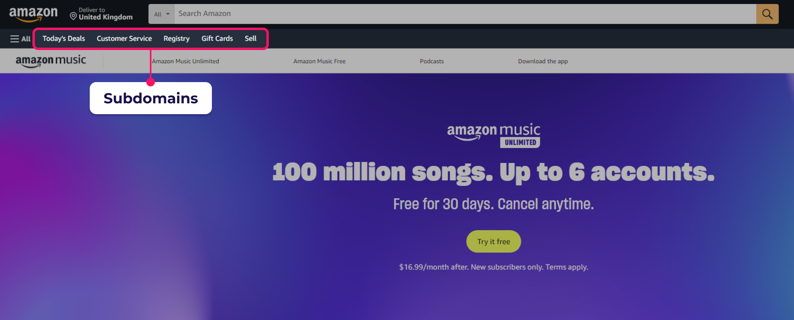
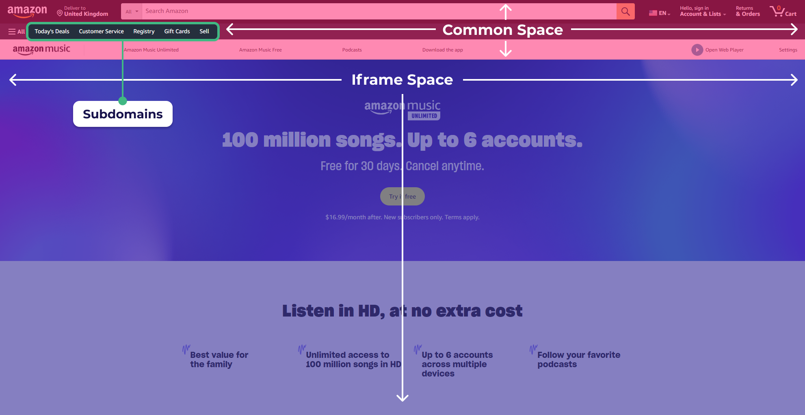

# Self-Contained Systems под микроскопом

Попробую, попытаюсь объяснить. Наверное, для кого-то это будет оправданием, но я просто объясняю.

Как быстро зафейлить новый проект Java? 
Просто взять и применить все, что ты услышал на последней Java конференции;) 
Как быстро сделать энтерпрайзный проект минимальной командой в короткие сроки? 
Верно — подобрать оптимальную архитектуру и правильные инструменты. 
Сегодня расскажу о компромиссном варианте между хайповыми (все еще) микросервисами и монолитами, который называется [Self-Contained Systems](https://scs-architecture.org/).
Кажется, он выпьет меньше крови и сохранит ваши нервы. Но обо всем по порядку.

Отмечу, что мы будем называть **Self-Contained Systems** «автономные системы» или кратко — **SCS**.


Следуя из названия, принцип подхода прост - разбиваем систему по доменам. В каждом домене находится независимый монолит(система).
Стараемся максимально не допускать связность между подсистемами.
Надпоминает микросервисы?
Но не делайте поспешных выводов!

Пройдя «Вьетнам» на одном энтерпрайз проекте с SCS-подобной архитектурой, я захотел сделать R&D по автономным системам.
Хотелось бы поделиться опытом исследований и рассказать как готовить SCS. 
Какой спектр задач может покрыть новоявленная концепция и к каким кейсам применить SCS станет для проекта идеальным решением?

### Как я узнал о SCS
Как-то на одном из дейликов или планерок, мы с коллегами <s>подняли срач</s> дискутировали на тему таргет аудитории [Jmix](https://www.jmix.ru/).
Можно ли написать огромный маркетплейс без колоссальных усилий на платформе?
А так как я уже знал ответ на этот вопрос, пройдя медные трубы в кровавом энтерпрайсе, у меня возникла мысль
написать проект, демонстрирующий, что можно сделать используя монолиты в 24 году (_куда большего,
чем вы могли бы представить_).

### Для кого это может быть актуально?
Очевидно, в бигтехе — Сбере, Озоне, ВТБ и других явова (см. [ЯВОВА/ВОТВАСЯ](https://habr.com/ru/articles/586426/)) 
все архитекторы будут воротить нос, как только услышат слово «монолит». 
В общем, у кого-то это щелкает, а у кого-то это не щелкает.

**В первую очередь**, SCS, как и сама статья, будут интересны людям, занимающимся E-commerce приложениями. 
Насмотревшись на кровавый энтерпрайз, могу сказать, если у вас скудный ресурс, 
а система большая, то SCS может стать целебной таблеткой, решающей многие проблемы среднестатистического проекта. 

**Вторая часть аудитории** — проекты, использующие современные фуллстак-фреймворки. 
Я, как разработчик фреймворка Jmix, а также любитель Ruby on Rails, могу заявить, 
что написание SCS будет для вас занимательным опытом. 
Ну или хотя бы прочтение данной статьи позабавит вас, как и мои цитаты Тинькова.

### Когда не стоит смотреть в сторону SCS?
Первое, если у вас большая нагрузка (в основном это касается UI), сложный и нестандартный UI, который проще написать на современных
фронтенд фреймворках с использованием SOA/микросервисов.
В общем, не тривиальный UI - не для нас.
Второе, если в проекте какие-то вычисления или риал-тайм работа с данными, проще будет сразу писать микросервисы.

Стоит отметить, что все перечисленные выше проблемы обычно не касаются энтерпрайса.

### Детальное погружение
Индикатором того, что ваш проект будет хорошо ложиться на SCS - наличие большого количества доменов и бизнес-логики, связанные с заполнением всяких форм.
Узнали? Это же наш (не)любимый энтерпрайс. Главное преимущество, которое получает проект при разделении на автономные системы - это
_"микросервисные монолиты"_. В таком подходе мы имеем повышенную устойчивость, деплой и другие плюшки, о которых я расскажу далее.


_Если говорить ~~душно~~ более научно, то_:
> **Self Contained Systems** — это независимые, самодостаточные и слабосвязанные системы (подсистемы), 
каждый из которых представляет собой отдельную часть функциональности в рамках большого программного продукта.

Перейдем на простонародный язык.
**Автономные системы** - это "_сообщающиеся монолиты_" с некоторым количеством "_но_" заимствованных из микросервисов.
Главные концепции - минимальная связанность между системами и отказоустойчивые коммуникации.

### Disclaimer. У самурая нет ~~плана~~ архитектуры - есть только ~~путь~~ задачи!

В правильных руках и монолит может стать крайне эффективной архитектурой (см. GitHub, GitLab, Shopify).
Не относитесь к статье как к постулатам! 
Зачастую, выбор архитектуры может быть делом вкуса и скиллов команды.

### Innoq - самый большой меинтейнер в комьюнити SCS.
Хотелось бы в кратце рассказать о главной акуле SCS - Innoq. С ресурсов и сайта innoq взято большинство контента,
представленного в статье.
Если перейти по [ссылке](https://www.innoq.com/en/cases/best-in-industry-e-commerce-plattform-fuer-elektronikkomponenten/),
можно почитать историю об успешном успехе компании,
построившие свою _E-Commerce систему_ на базе Self-Contained Systems.
Скриншот ниже, взятый с сайта Innoq, примерно знакомит нас с архитектурой SCS.


Как мы можем наблюдать, каждая из подсистем innoq - это набор монолитов, разбитых на домены.
Подмечу, есть общая система, которая собирает все разрозненные элементы UI вместе. Сейчас опустим этот момент,
но чуть позже я объясню, зачем нужен этот элемент системы.

Чтобы лучше прочувствовать разницу между SOA и микросервисами, я добавил картинку ниже,
демонстрирующую разницу в этих подходах.


## Философия Self-Contained Systems!


Сообщество энтузиастов сформулировали некоторое количество принципов, следуя которым, можно написать хорошую
систему, построенную на SCS. _На сайте SCS можно детально почитать про данные принципы_. 

### Основные принципы:
Ниже находится пересказ всех поинтов, описанных комьюнити и Innoq. 

_От себя добавил некоторые недосказанные поинты, а где-то добавил комментарии.
Здесь не будет никаких искажений оригинала, лишь объяснения. 
Мое мнение о работе SCS в реальном мире я выскажу чуть позже._

* **Доменное разбиение**: Важнейшей составляющей SCS является разбиение системы на домены. Каждый домен представляет
  собой независимую подсистему, сосредотачивающуюся на своей области ответственности.
* **Сосредоточенность на домене**: Желательно, чтобы каждая система не выносила и не привносила свои внутренние
  объекты за границы ответственности своей же области.
* **Минимизация оверхеда**: Каждая подсистема должны выглядеть как микросервис с архитектурной точки зрения.
* **Сервисность**: Допускается использование микросервисов для решения доменной бизнес логики (для одной системы
  использование n микросервисов в бекенде).
* **Отдельная база данных**: Каждая система, подобно микросервисам, обязана иметь свою собственную базу данных.
* **Технологическая свобода**: Отсутствие ограничений в выборе технологий позволяет адаптировать подход к конкретным
  потребностям проекта.
* **Асинхронные коммуникации**: Коммуникации между системами должны быть асинхронными. Это обеспечивает более
  эффективное взаимодействие и гибкость. Межсистемные коммуникации должны использовать HTTP Rest или легковесный брокер
  сообщений.
* **Сосредоточенность команд**: Одна команда может работать над одной или несколькими подсистемами. Но над отдельной
  подсистемой может работать ТОЛЬКО одна команда.
* **Минимизация связности**: Уровень связности между системами должен быть минимальным, обеспечивая тем самым легкость
  поддержки и модификации.
* **Переиспользуемость**: Над всеми системами существуют проект или проекты, вобравшие в себя все общие от систем.
  Общие UI компоненты, общие сущности и DTO, API подсистем, которые вынесены наружу,
  общие вычисления, подходы. _Пример - общий Oidc плагин для работы с Keycloak_.
* **Отдельный UI**: Каждая система имеет свой собственный UI, который должен синергировать по стилю с другими системами.
  Синергия должна достигаться по средствам общего UI Toolkit.
* **Слияние**: Все подсистемы с точки зрения UI/UX должны выглядеть как одно целое. Излишние сообщения между системами
  должны уменьшаться по средствам использования Web интерфейсов, таких как hyperlink, `iframe` и те.
* **Обобщенный UI**: При использовании `iframe` должен быть root-layout система, которая объединяет все подсистемы в один UI.
* **Связанный UI**:При использовании hyperlink-ов, они обязаны работать в ОБЕ стороны.

Все эти принципы по отдельности носят лишь рекомендательный характер, не стоит слишком сильно подгонять свою систему
под все вышесказанные поинты. Но чем меньше вы отступаете от постулатов, тем меньше проблем вы получите в перспективе.

### Ключевые аспекты философии:
_Ниже комментарии от меня, которые поясняют некоторую недосказанность философии Self-Contained Systems._

* **Логическое разбиение системы на домены** <br/>
    В зависимости от области, где функционирует система, SCS может принимать различные формы.
    Соблюдение указанных выше принципов рекомендуется, но также зависит от конкретной доменной области.

* **Автономность систем и подход к коммуникациям**. <br/>
    При переходе от общего к частному следует внимательно взвешивать, принимая во внимание потребности
    конкретного проекта. Проблема коммуникаций: как бы ни топило комьюнити за асинхронные коммуникации,
    это не всегда доступно или целесообразно.
    Например, в моем демо не было явных асинхронных коммуникаций.
    Такая уж доменная область. 
    Если так сильно хочется асинхронные коммуникации, то лучше воспользоваться брокером сообщений.

* **Связность и использование iframe**. <br/>
    Третий аспект касается связности между системами, UI и применения iframe. В зависимости от требований проекта, системы
    могут содержать разное количество iframe или вовсе обходиться без них.
    То же касается и общего UI Toolkit, Root layout Service и других пунктов, связных с UI. 
    **Главное** - в автономных системах вероятно проектирование UX/UI будет более сложной задачей, чем проектирование
    коммуникаций.

* **Использование фреймворков**. <br/>
    Так как мы используем наши любимые фреймворки в построении подсистем, то у нас есть доступ к всем их плюшкам. Однако,
    отсюда и вытекает один интересный момент, что при использовании монолитных фреймворков,
    вас поощряют за написание сложных систем со сложной бизнес логикой, вследствие чего, отдельная система редко получается
    действительно по размерах подходящей к термину "микро" сервис.

## Плюсы, минусы

Теперь обсудим что мы получаем, выбрав SCS. На какие грабли можно наступить в таком подходе?

### Плюсы:

* **Отказоустойчивость**: Автономные системы обеспечивают устойчивость, поскольку сбои в одной системе не влияют на
  остальные.
* **Простое разделение по командам**: Каждая подсистема может быть независимо разрабатываемой и поддерживаемой командой,
  что способствует гибкости в управлении проектом.
* **Сервисная ориентированность**: SCS способствует созданию сервисно-ориентированных систем, где каждая часть выполняет
  конкретные функции.
* **Преимущества монолитов**: Архитектура сохраняет выгоды монолитов, такие как скорость разработки, возможность
  использования любимых фреймворков, а также наличие фуллстек UI и ORM.
* **Независимый деплой**: Возможность обновлять и масштабировать каждую подсистему независимо, что упрощает управление
  версиями и обеспечивает гибкость в развертывании.
* **Предпочтительное решение для энтерпрайса**: В некоторых случаях SCS может представлять собой более выгодное решение для
  энтерпрайса, чем микросервисы, благодаря более простому управлению и большей схожести с монолитами.

### Минусы

* **Разделенный UI**: Необходимость долгого проектирования коммуникаций и пользовательского интерфейса между автономными
  подсистемами.
* **Усложненные коммуникации**: В сравнении с монолитом требуется более тщательное проектирование и внимание к
  взаимодействию между системами.
* **Усложненный деплой**: Процессы развертывания становятся более сложными по сравнению с монолитной архитектурой.
* **Дополнительная документация и взаимодействие команд**: Вводится дополнительная необходимость в документировании и
  согласовании работы между различными командами, что может потребовать дополнительных ресурсов.
* **UI Toolkit**: Необходимость выделения времени на согласование общего набора инструментов для пользовательского
  интерфейса.
* **Невозможность ускорения UI**: В отличие от выноса бизнес-логики, ускорение пользовательского интерфейса может
  оказаться более сложной и дорогостоящей задачей.

### Минусы в реалиях энтерпрайса

Однако все эти недостатки могут быть менее релевантными для B2B и E-Commerce систем, где количество пользователей
вторично по сравнению с множеством бизнес-процессов и объемом бизнес-логики. Круто? ДА это же круто.

## Back to reality: Демо-пример и выбор объектной модели

Той еще проблемой для меня стал выбор темы демо. CRM? Пэт-клиника? Онлайн магазин? Public Cloud?
Ох, вы бы знали сколько я думал над тем, что же выбрать... 
В итоге, взвесив все плюсы и минусы, я решил, что мой выбор - доставка еды.
Эта тема не только предоставляет широкий спектр бизнес-процессов, но и близка к повседневной реальности аудитории.
Ну кто хоть раз не пользовался доставкой еды? 
И понять легко и бизнес-процесс прозрачный и большой;)

### План работ
Раз с темой разорались, пора переходить к планированию. В выбранной области стоит выделить:
* Домены
* Сущности и отношения между ними
* Флоу\процессы
* Правила и констреинты

Далее опустим некоторое количество правил, которые нам будут сильно усложнять работу. Обычно такие правила являются 
жизненно важными для бизнеса, но с хай-левел точки зрения являются мелочами. Например - мы не будем обрабатывать случай,
когда курьер подскользнулся на льду и расшибся:)

### Доставка еды
Пожалуй, иконка проекта выбрана.
А может мне стоило попросить DALL-e сгенерировать ее вместо меня...
Кстати, на иконке спойлеры =)


Пора выбрать основные домены внутри доставки еды, без которых понятие доставки не может работать.

### Ресторан (Restaurant System):
В этом домене фокусируется вся информация о ресторанах.
Здесь осуществляется регистрация и создание новых ресторанов.
Администраторы ресторанов имеют возможность настраивать меню, добавлять и редактировать блюда, а также принимать заказы
на готовку еды.
Этот домен является ключевым для организации бизнес-процесса внутри ресторанов.

### Доставка (Delivery):
Домен доставки фокусируется на управлении курьерами. Здесь происходит регистрация курьеров, назначение им роли
доставщика, а также менеджмент заказов, связанных с доставкой.
В этом домене осуществляется эффективное управление логистикой и выполнением заказов.

### Заказы (Order System):
Центральным доменом в системе доставки еды является система заказов. Здесь пользователи начинают бизнес-процесс,
создавая заказы.
Интерфейс для создания заказов, наполнение корзины и все запросы, связанные с бизнес-процессом доставки еды, исходят
именно из этого домена.
Здесь происходит взаимодействие с другими подсистемами и интеграции для эффективного выполнения заказов.

### Важное отступление перед демо:

В реальной системе должны существовать дополнительные домены, без которых доставка не имеет смысла.
Эти домены включают систему платежей, уведомлений, построения маршрутов доставки и триггеров геолокации.
Они представляют собой важные аспекты реальной системы, но в рамках демонстрации SCS мы упростим структуру и
сфокусируемся на интеграциях между основными подсистемами.

Перед проведением демо Self-Contained Systems я решил упростить некоторые аспекты бизнес-процесса доставки
еды.
Мы не будем рассматривать сложные сценарии, такие как оплата и отмена заказов, чтобы минимизировать сложность написания
кода и ускорить прототипирование проекта.
**Роли будут минимальными** для удобства работы, и мы учтем другие аспекты, которые упростят и ускорят процесс написания
доставки еды.
_Наша основная цель - продемонстрировать эффективные интеграции между различными подсистемами._

### Основные задачи для демо

1. **Flow-диаграмма и архитектура:** <br/>
   Начнем с создания Flow-диаграммы и определения архитектуры проекта. Это поможет нам лучше понять взаимодействие между
   системами.
2. **Выбор технологического Стека:**<br/>
   На основе Flow-диаграммы мы определимся с технологическим стеком. Какие инструменты и языки программирования будем
   использовать. Хотя спойлеры вы выше видели.
3. **Пробежимся по коду:**<br/>
   Ну как статья может быть и без кода... Такого быть не может. Если кто-то утверждает обратное - да на кол его! Если без шуток,
    то в этом пункте я укажу главные куски кода отвечающие за интеграции между системами, да и то ввиде скрывающихся деталей.
    Если хотите полный проект - я оставил ссылку на [Github репозиторий](https://github.com/KartnDev/FoodDeliveryJmix).
4. **Переход к демонстрации:**<br/>
   Быстро пробежимся по результату, которого мы добились.

#### Взглянем на систему с высока

У нас есть три ключевые подсистемы и три типа пользователей.

Подсистемы:

* **Система Заказов (Order System)**: Взаимодействие с пользователями.
* **Система Курьеров (Courier System)**: Ориентирована на курьеров.
* **Система Ресторанов (Restaurant System)**: Администрирование ресторанов.

### Flow-диаграмма и BPMN

Ниже представлена Flow-диаграмма того, что будет происходить в системе.
Да. Она немножечко страшная;) А вы видели простые Flow-диаграммы?

Стоит сделать отступление, что будет еще один шаг, который мы опустим.
Это шаг самой физической доставки курьером от точки А до точки Б.
Вместо этого мы просто подождем 10 секунд и сразу поменяем статус заказа на "доставлен".
<details>
  <summary>Flow Diagram</summary>


</details>

Для более наглядного представления мы решили вместо Flow-диаграммы использовать более высокоуровневую BPMN-диаграмму,
которую мы будем использовать в рамках проекта.


Это более интуитивное представление процесса. В общих чертах, мы создали простой сценарий:

1. **Пользователь заходит в систему заказов.**
   Система заказов загружает список ресторанов из системы ресторанов (какая-то тавтология).
2. **Пользователь выбирает ресторан.**
   Система загружает из системы ресторанов список еды и меню для пользователя. Пользователь составляет корзину из
   предложенного и сохраняет заказ.
3. **Система заказов сохраняет копии заказа пользователя и запускает бизнес-процесс.**
4. **Система заказов делает HTTP-запрос в систему ресторанов с запросом на готовку еды.**
   Процесс останавливается и ожидает, пока ресторан подтвердит.
5. **Админ ресторана заходит в систему (ресторанов), берет заказ на приготовление еды.**
   Система ресторанов делает обратный HTTP-запрос в систему доставки еды. Система заказов продолжает бизнес-процесс.
6. **Система заказов делает HTTP-запрос в систему ресторанов курьеров и публикует запрос на доставку.**
7. **Курьер заходит в систему доставки, берет на себя текущий заказ.**
   Система курьеров делает обратный HTTP-запрос в систему заказов, продолжается бизнес-процесс.
8. **Начинается доставка.**
   Здесь мы имитируем доставку и другие элементы путем ожидания 10 секунд. Этот этап пустой. Затем бизнес-процесс
   приостанавливается, ожидая завершения доставки.
9. **Курьер доставил еду.**
   Заходит в систему и подтверждает окончание доставки. Система курьеров делает обратный HTTP-запрос в систему заказов.
   Бизнес-процесс продолжается.
10. **Финальный шаг.**
    Заказ переводится в статус "доставлен", и бизнес-процесс завершается.

### UI и принципы разделения по доменам

Учитывая полную автономию и независимость наших трех систем,
мы избегаем использования фреймов или ссылок,
так как нет необходимости в установлении жестких связей между ними.
Каждая из трех систем эффективно функционирует независимо от других. 

Из-за высокой степени автономии между системами,
нам не требуется создавать отдельную систему,
которая бы служила корневой для всех подсистем и
предоставляла бы контент в виде iframe-ов для каждой из них.
Вместо этого мы предпочитаем поддерживать
независимость каждой системы, не нарушая ее автономии.

Такой подход дает нам гибкость и свободу в разработке каждой подсистемы,
а также упрощает управление и поддержку проекта в целом,
поскольку каждая система может эффективно разрабатываться и
внедряться независимо от остальных.

**Для самых любознательных я приведу краткий
пример системы с общим layout-ом в конце статьи.**

### Выбор технологий

<details>
  <summary>Мысли сбежавшего из дурки о выборе технологий</summary>

При выборе технологий для реализации архитектурного паттерна Self-Contained Systems
в ~~энтерпрайз-проекте~~ моем демо, учтем не только функциональные требования,
но и особенности объектной области. А у нас есть некоторый функционал, которые можно покрыть реализациями из коробки.

В данном случае, я остановился на языке программирования Java со Spring Boot-ом.
_Но вы думаете что я буду использовать просто Бут будучи разработчиком другого фреймворка?_

Конечно же воспользуемся Jmix! С его помощью мы получаем не только современный UI, но и встроенный движок Bpmn,
что важно для обеспечения потребностей бизнес-процессов.

Дополнительно, **Flowable** используется в качестве Bpmn 2.0 движка,
предоставляя необходимую **асинхронность** и **отказоустойчивость**,
что являются **критическими компонентами** для успешной работы в корпоративной среде.
В контексте управления пользователями между системами было принято решение использовать `Keycloak`.
Этот выбор обусловлен не только простотой интеграции,
но и созданием единой точки управления пользователями, что обеспечивает удобство и единообразие.


</details>


#### Итак, технологический стек нашего проекта включает в себя:

- Jmix FlowUI:
    - Spring Boot 3
    - VAADIN 24 (Vaadin Flow)
- Keycloak
- Flowable (в роли Bpmn 2.0 движка для бизнес-процессов + асинхронность)

### Архитектура коммуникаций

Настоятельно рекомендую тщательно ознакомится с тезисами, изложенными ниже, тк они фактически решают 
какие границы ответственности мы используем.


В данном примере мы сознательно упрощаем сценарий, демонстрируя, 
что для построения устойчивой системы не всегда необходимо использовать
асинхронные и/или реактивные методы коммуникации.

1. При посещении пользователем страницы заказа мы предоставляем ему все объекты передачи данных (DTO), 
полученные из ресторанов. Это гарантирует, что до начала процесса и формирования заказа 
мы не вмешиваемся в консистентность данных. 

    * _Согласно контракту, установленному до момента запроса списка блюд 
    и до его завершения, цены не будут изменяться._
    В начале процесса, когда пользователь еще не создал корзину от нас ничего не требуется.
    * Следовательно, **неблокирующие асинхронные запросы не требуются**, 
    поскольку у пользователя нет объектов для просмотра, и он все равно должен ожидать загрузки данных и 
    отображения элементов меню.

2. При создании заказа пользователем мы сохраняем копии выбранных им блюд, обеспечивая, 
таким образом, **надежность** в случае изменения или удаления элементов из меню ресторана.

3. Все взаимодействия остаются внутри процесса. 
С учетом того, что мы пишем процесс с использованием Bpmn 2.0 и движка Flowable,
запросы будут отправляться **асинхронно**.

4. Мы реализуем паттерн **Request-Wait-ResponseAfter** через Flowable:
    - Асинхронно отправляем запрос в другую систему в рамках отдельной задачи в бизнес-процессе.
    - Затем останавливаем процесс на задаче для пользователя, ожидая подтверждения продолжения процесса из другой системы.

При получении ответа от другой системы мы возобновляем пользовательскую задачу, и процесс продолжает свой ход. 
Этот подход решает множество проблем, связанных как с устойчивостью, так и с минимизацией межсистемных коммуникаций.

### Реализация в двух словах
_Изначально статья должна была быть детальной, но если затянуть с объяснением всего, то кажется ее бы можно было
изложить только в 12 часовой видос на youtube или небольшую книгу._ Потому буду давать фрагменты кода и комментарии.
Начнем сначала.

#### Создание базового функционала Restaurant System

Нужен CRUD для ресторанов, еды и меню внутри ресторана. Так как мы пишем на Jmix - у нас есть возможность написать полноценный сайт, а не 
использовать Rest API и какой-нибудь Postman.

Сущности первой необходимости:
- **Restaurant**
- **RestaurantMenu**
- **RestaurantMenuItem**

Пропущу код связанный с созданием UI, лишь скажу, что мы создали:
- **экран**(да, да, именно экран, так страницы называются в Jmix) **списка ресторанов**
- **экран настройки ресторана для админа**
- **экран ресторана с деталями** (список еды, список меню)
- **экран деталей еды и экран деталей меню**

Прикрутим Rest для того, чтобы можно было из системы **Заказов** доставать список ресторанов и их содержимого:
<details>
  <summary>RestaurantController</summary>

```java
@Secured(FullAccessRole.CODE)
@RestController
@RequestMapping(value = "api/v1")
public class RestaurantController {

    private final RestaurantRepository restaurantRepository;
    private final DataManager dataManager;
    private final AttachmentService attachmentService;
    private final FetchPlans fetchPlans;
    private final RestaurantMenuRepository restaurantMenuRepository;

    @GetMapping("/restaurants")
    public List<RestaurantDTO> listRestaurants() {
        return StreamSupport.stream(restaurantRepository.findAll().spliterator(), false)
                .map(restaurant -> {
                    var dto = new RestaurantDTO();
                    dto.setId(restaurant.getId());
                    dto.setName(restaurant.getName());
                    dto.setDescription(restaurant.getDescription());
                    dto.setIcon(attachmentService.getAttachmentAsByteArray(restaurant));
                    return dto;
                })
                .toList();
    }

    @GetMapping("/restaurants/{id}")
    public RestaurantDTO getRestaurant(@PathVariable Long id) {
        Restaurant restaurant = restaurantRepository.getById(id);
        var dto = new RestaurantDTO();
        dto.setId(restaurant.getId());
        dto.setName(restaurant.getName());
        dto.setDescription(restaurant.getDescription());
        dto.setIcon(attachmentService.getAttachmentAsByteArray(restaurant));
        return dto;
    }

    @GetMapping("/restaurants/{restaurantId}/menus")
    public List<RestaurantMenuDTO> listRestaurants(@PathVariable Long restaurantId) {
        return restaurantMenuRepository.findRestaurantMenuByRestaurantId(restaurantId)
                .map(menu -> {
                    var menuDTO = dataManager.create(RestaurantMenuDTO.class);
                    menuDTO.setId(menu.getId());
                    menuDTO.setName(menu.getName());
                    menuDTO.setItems(convertItemsToDTO(menu.getItems()));
                    return menuDTO;
                })
                .toList();
    }
}
```
</details>

Итак, как только мы написали все необходимые эндпоинты, можем перейти к настройке ресторанов.
Создадим пару ресторанов и еду в них, чтобы было с чем работать в системе заказов.

Предлагаю создать **StarBucks**, а то в последнее время его не хватает. _Хотя нет, чего действительно не хватает - это **Сбер Пиццы**._
Реализуем же фантазии, кто знает, возможно это станет правдой...


Заполним рестораны. Остановимся только на сберпицце)

1. Детали </br>
    
2. Еда </br>
    
3. Меню, они же табы для клиентов </br>
    

Думаю со cбера хватит. Переходим к **OrderService**.

На этом этапе нам необходим лишь функционал создания корзины, все остальное будет реализовано в следующих шагах с бизнес-процессом.

* Создадим **общий API пакет**, который будет содержать описание всех **REST моделей** (на самом деле он уже есть и все модели выбаются с Rest-а).
* Добавим необходимые сущности для первичной работы с корзиной:
  * **OrderEntity** - сама сущность заказа
  * **RestaurantFoodItemReplica** - реплика еды в текущем состоянии. Не буду слишком долго вдаваться в микросервисные паттерны, но в кратце такие сущности 
  обычно хранятся как json документы, которые уменьшают нагрузку и связность между подсисетмами. Мы для простоты будем хранить их в ACID в Postgres
  * **FoodItemCountedEntity** - Сущность, которая хранит конкретную еду и счет сколько еды было выбрано
* **Добавим UI для корзины.** Надо будет отобразить список ресторанов на выбор. И тут происходит самое интересное!
_Нам не нужна асинхронность, чтобы отобразить список ресторанов, так как банально юзер и так ждет, пока список загрузится._
Когда загрузятся рестораны, а клиент выберет нужный ресторан, он пойдет в конкретный ресторан и сие действие повториться, но уже для еды и меню.
Давайте посмотрим на клиент для **RestaurantSystem** внутри системы заказов:<br/><br/>
    <details>
      <summary>RestaurantClient</summary>
    
    ```java
      @Component
      public class RestaurantClient extends AbstractClient {
    
        public List<RestaurantDTO> listRestaurants(String subjectToken) {
            String url = MessageFormat.format("{0}/api/v1/restaurants", caclRestaurantUrl());
            return getApi(url, HttpMethod.GET, new ParameterizedTypeReference<List<RestaurantDTO>>() {}, null, subjectToken);
        }
    
        public RestaurantDTO getRestaurantById(Long restaurantId, String subjectToken) {
            String url = MessageFormat.format("{0}/api/v1/restaurants/{1,number,#}", caclRestaurantUrl(), restaurantId);
            return getApi(url, HttpMethod.GET, new ParameterizedTypeReference<RestaurantDTO>() {}, null, subjectToken);
        }
    
        public List<RestaurantMenuDTO> listRestaurantMenus(Long restaurantId, String subjectToken) {
            String url = MessageFormat.format("{0}/api/v1/restaurants/{1,number,#}/menus", caclRestaurantUrl(), restaurantId);
            return getApi(url, HttpMethod.GET, new ParameterizedTypeReference<List<RestaurantMenuDTO>>() {}, null, subjectToken);
        }
    }
    ```
    </details>
    <br/>
    Опустим лишние детали, нас тут интересует только то, что все "стартовые" запросы процесса по доставке еды могут быть синхронные, тк
    используются только на стороне юзера для UI.

#### Перейдем к проверке работы корзины, сделаем заказ
1. Выберем ресторан. КОНЕЧНО ЖЕ СБЕР ПИЦЦА </br>
   
2. Удостоверимся, что все меню и еда пришла верная </br>
   
3. Соберем инвестиционный портфель. Ой, то есть соберем корзину еды, конечно же. </br>
   

Отлично, корзина готова и можно приступать к самому интересному - бизнес процессу, который мы обозначили пару топиков назад.

### Бизнес процесс всему голова!

Так как у нас есть `Flowable` и есть реальный бизнес процесс, который можно описать, то построим всю доставку еды на BPMN:


Все те же шаги, что и в том красивом бизнес процессе. Осталось дело за малым - привязать все `ServiceTask` (те что с колесиком) к Java коду.

#### Больше деталей: как UserTask решит все мои проблемы
Многие задумались, а как я буду решать проблему, когда возникает некоторое ожидание, когда мы ждем готовку еды или когда ищем курьера?

**И тут самая главная идея BPMN нам помогает**! 

> **UserTask** - это объект нотации bpmn, когда бизнес процесс перестает исполняться и встревает на UserTask в
ожидании, когда таску продолжат. То есть, мы пойдем исполнять по очереди java код для каждой сервис таски, пока не наткнемся на первую UserTask-у.
Чтобы "разморозить" исполнение бизнес процесса, нам понадобиться специально найти эту таски и сказать "а-ну продолжайся!".

_Короткий экскурс в bpmn окончен_. Погнали к делу:

Как только наш заказчик подтвердил свою корзину, мы начнем бизнес-процесс и присвоем ему статус НАШЕЙ КОРЗИНЫ (заказа).
Получается, зная в каком мы инстансе бизнес-процесса, мы знаем и номер заказа.


Остается только запустить процесс из экрана, когда заказчик нажимает кнопку подтверждения
(я тут нарочно избегаю слово клиент во избежание путаницы со словом SomeHttpClient).
```java
    public ProcessInstance startOrderProcess(String orderId) {
        AppUser appUser = (AppUser) currentAuthentication.getUser();

        Map<String, Object> processVariables = Map.of(
                PROCESS_USER_KEY, appUser.getUsername()
        );
        return runtimeService.startProcessInstanceByKey(ORDER_PROCESS_SCHEMA_ID, orderId, processVariables);
    }

```

И сразу пройдем к первому шагу. Присваиваем ему статус нового и сохраняем в транзакционный контекст.

```java
    @Override
    protected void doTransactionalStep(DelegateExecution execution, OrderEntity order, SaveContext saveContext) {
        order.setStatus(DraftOrderStatus.NEW_ORDER);
        saveContext.saving(order);
        doSomeWork();
    }
```

#### Асинхронные ServiceTask и bpmn паттерн **Request-Wait-ResponseAfter**

Далее все наши ServiceTask будут исполняться в отдельных потоках, будут помечены асинхронным флагом и принадлежать к разным транзакциям, тем самым
мы даем гарантии, что наш код будет всегда максимально изолирован и устойчив к ошибкам. Да, да, бизнес процесс можно еще и откатывать)

Не буду освещать все шаги, так как они однотипны, лишь рассмотрим один общий паттерн, по которому проходит весь бизнес процесс:
1. Мы делаем Http запрос в асинхронной ServiceTask в другую систему с запросов "сготовьте еду в таком то ресторане"

    <details>
      <summary>RequestRestaurantCookStep</summary>
   
   ```java
        @Service
        public class RequestRestaurantCookStep extends AbstractTransactionalStep {
            private final Logger log = LoggerFactory.getLogger(RequestRestaurantCookStep.class);
            private final RestaurantClient restaurantClient;
            private final OrderService orderService;
            
            @Override
            protected void doTransactionalStep(DelegateExecution execution, OrderEntity order, SaveContext saveContext) {
                String username = getVariable(execution, PROCESS_USER_KEY);
                String subjectToken = exchangeOidcTokenForUser(username);
                String result = systemAuthenticator.withUser(username,
                        () -> restaurantClient.publishRestaurantCookRequest(order.getRestaurantId(), orderService.convert(order), subjectToken));
                log.info("Result from restaurant system for cook request: " + result);
                order.setStatus(DraftOrderStatus.WAIT_FOR_RESTAURANT);
                saveContext.saving(order);
                doSomeWork();
            }
        }
    ```
    </details>

   <details>
   <summary>RestaurantClient#publishRestaurantCookRequest</summary>
   
   ```java
    public String publishRestaurantCookRequest(Long restaurantId, OrderDTO orderDTO, String subjectToken) {
        String url = MessageFormat.format("{0}/api/v1/restaurants/{1,number,#}/cook", restaurantUrl, restaurantId);
        return getApi(url, HttpMethod.POST, new ParameterizedTypeReference<String>() {}, orderDTO, subjectToken);
    }
    ```
    </details>

2. При обработке запроса на готовку в системе ресторанов сохраняется запрос для дальнейшего отображения админам.
   <details>
   <summary>RestaurantController#getRestaurantCookRequest</summary>

   ```java
    @PostMapping("/restaurants/{restaurantId}/cook")
    public String getRestaurantCookRequest(@PathVariable Long restaurantId, @RequestBody OrderDTO orderDTO) {
        cookOrderService.submitNewCookOrderFromDTO(orderDTO);
        // we will not bring case that restaurant will not cook, placeholder response
        return "Accepted";
    }
    ```
    </details>

   <details>
   <summary>CookOrderService#submitNewCookOrderFromDTO</summary>

   ```java
    public void submitNewCookOrderFromDTO(OrderDTO orderDTO) {
   
        var cookOrderRequest = create(CookOrderRequest.class);
        cookOrderRequest.setOrderId(orderDTO.getOriginOrderId());
        cookOrderRequest.setIsDone(false);
        cookOrderRequest.setRestaurant(restaurantRepository.getById(orderDTO.getRestaurantId()));
        cookOrderRequest.setCookingItems(createCookingListFromDTO(cookOrderRequest, orderDTO));
   
        save(cookOrderRequest);
    }
    ```
    </details>
3. Админ ресторана заходит в список задач на готовку, берется за нее, тем самым отправляет обратный Http запрос обратно в систему заказов.
    <details>
       <summary>OrderProcessController#continueOrderRestaurantStep</summary>
    
   ```java
        @PostMapping("/orders/{orderId}/restaurantstep/{restaurantId}")
        public void continueOrderRestaurantStep(@PathVariable String orderId, @PathVariable String restaurantId) {
            orderProcessManager.continueProcessByRestaurantStep(orderId, restaurantId);
        }
   ```
    </details>
4. Когда приходит Http запрос от системы ресторанов (ответ на запрос о готовке) - мы продолжаем наш бизнес-процесс далее
    <details>
       <summary>OrderProcessManager#continueProcessByRestaurantStep</summary>

   ```java
        public void continueProcessByRestaurantStep(String orderId, String restaurantId) {
            OrderEntity order = orderRepository.getById(Long.parseLong(orderId));
            if (!order.getRestaurantId().toString().equals(restaurantId)) {
                throw new RuntimeException(MessageFormat.format("Illegal access for task(Order No.){0} exception, restaurantId {1}", orderId, restaurantId));
            }
            continueUserTaskInProcess(orderId, "WAIT_RESTAURANT_CALLBACK_TASK");
        }
    
        private void continueUserTaskInProcess(String orderId, String taskDefinitionId) {
            ProcessInstance processInstance = runtimeService.createProcessInstanceQuery()
                    .processInstanceBusinessKey(orderId)
                    .singleResult();
            Task restaurantTask = taskService.createTaskQuery()
                    .processInstanceId(processInstance.getId())
                    .active()
                    .taskDefinitionKey(taskDefinitionId)
                    .singleResult();
            taskService.complete(restaurantTask.getId());
        }
   ```
    </details>
5. СУУУУПЕР ГУД. **Request-Wait-ResponseAfter** реализован в бизнес-процессе. 
6. Далее делаем то же самое для шагов с поиском курьера и подтверждением окончания доставки от курьера. 

_Усложнять статью не буду, потому опущу код, связанный с точно такими же шагами с курьером и сервис-тасками, которые просто 
меняют статус заказа._


## Результат демо


_Кому интересно, исходное видео [тут](https://www.youtube.com/embed/efRAFGayFbY?si=EOYlFjc3zk1mBWeN)_

Подведем промежуточные итоги для текущего демо проекта:
1. Мы построили проект доставки еды в стиле Self-Contained Systems;
2. Проект получился весьма устойчивым к ошибкам;
3. Связность между подсистемами минимальна;
4. Большинство поинтов философии SCS были поддержаны (в том числе асинхронные и отказоустойчивые коммуникации);
5. По времени это заняло сущие копейки.

#### А теперь все бежим переписывать наши монолиты на Self-Contained Systems


## Альтернативный вариант Self-Contained Systems через iframe 

Но все же! Мы не использовали `iframe` и проект получился не очень связным в UI и все связи находятся только на уровне коммуникаций.
Предлагаю вкратце рассмотреть пример, как можно написать SCS при помощи iframe.

Данный вариант построения самодостаточных систем является более каноничным, тк на сайте в первых поинтах сразу упоминают iframe. 
Хоть я и не считаю, что такой подход имеет большой потенциал (достаточно трудно найти подходящий бизнес-сценарий), мы обязаны его
рассмотреть.

Перейдем на **Amazon.com**, возьмем как пример веб магазина, у которого существует множество поддоменов(подсистем):

1. В меню борде мы видим список разных ссылок на подсистемы, которые могут быть реализованы отдельными "монолитами".
Их мы и выделим в качестве подсистем. Но для подсистем надо иметь общий layout (common space).
   <br/>
   
2. В то время как для контента подсистем надо выделить большое пространство, где мы будем отображать UI выделенной подсистемы, которую пользователь
выберет
3. Следовательно, декомпозиция на подсистемы с общей UI системой будет выглядеть примерно так:
    <br/>
    

Что происходит когда пользователь заходит на такой сайт?

1. Загружается страница с общим layout и каким-то placeholder контентом по центру, где у нас пространство iframe.
Либо мы сразу подгружаем дефолтную подсистему для пользователя в iframe space
2. В меню есть ссылки при нажатии на которые мы подменяем iframe-ы, каждый из которых ведет в свою подсистему.
3. При подгрузке iframe так же прокидываются cookie, поэтому пользователь, залогинившийся в одну общую систему, считай
залогинился во все.

Пример взят из [видео-ряда](https://youtu.be/xkQ9VaNTwxM?si=2VijRpPZajt0d3P3) англоязычного [контент-мейкера](https://www.youtube.com/@SoftwareDeveloperDiaries) с ютуба.

## Подведем итоги

* Чуть-чуть углубились в Self-Contained Systems;
* Рассмотрели ~~шизотеорию~~ философию комьюнити;
* Создали демо приложение доставки еды и разобрали альтернативный вариант написания Self-Contained Systems, который
более близок к исходному комьюнити и Innoq;

Надеюсь, я развлек вас сколько-то интересным контентом. 
А в ваших руках появился еще один инструмент решений проблем в проектировании ПО.

