# Food Delivery Jmix


## Setup (for local development)

To run FoodDelivery application, you should do several steps:
1. Local infrastructure
2. Setup hosts for application urls and hosts
3. Configuring Keycloak
4. Import tokens from Keycloak into the application properties for each standalone systems
5. Run application

### Local infrastructure
First, you need to start docker to deploy Postgres and Keycloak locally. Therefore, you have to options:
* Run docker compose from console
    ```shell
    docker-compose --project-directory FoodDelivery-all up
    ```
* Alternatively, if you are using IDEA Ultimate, you can open `docker-compose.yml` file and run it by clicking "run" button on the left side:


Now all our local infrastructure is deployed.

### Configuration for host names

We have 3 systems:
1. restaurant systems (running on port 8080, local host)
2. order systems (running on port 8081, local host)
3. courier systems (running on port 8082, local host)

So, there is a problem inside Vaadin to use several applications in one hostname - cookies and internal datastore on frontend part cannot exist without unless overrides.
To fix it - we will define 3 several hostnames for same local host -> 127.0.0.1.

```
    127.0.0.1	localhost
    255.255.255.255	broadcasthost
    ::1             localhost
    127.0.0.1       order.io
    127.0.0.1       restaurant.io
    127.0.0.1       courier.io
```
#### Otherwise, choose proxy hosts option
if you do not want to use port with hosts like "courier.io:8081", "restaurant.io:8080", there is another solution:
1. use allowed allocated local IPs for host names for systems:
    ```
        127.0.0.1	localhost
        255.255.255.255	broadcasthost
        ::1             localhost
   
        # random value, not a real IP list
        156.28.12.56        order.io 
        182.11.244.12       restaurant.io
        143.192.11.12       courier.io
    ```
2. Proxy all systems from local host with ports into selected IPs. 
I will skip proxy setting because for all OS this is many different solutions to do it. 
You can use `iptables -t nat -A PREROUTING -p tcp` on linux, `netsh interface portproxy add` or `rdr pass on lo0 inet proto tcp` for macOS 10+.
    ```
        # Pseudo-proxy setting
        127.0.0.1:8081 -> 182.11.244.12    # order system local IP
        127.0.0.1:8080 -> 156.28.12.56     # restaurant system local IP
        127.0.0.1:8082 -> 143.192.11.12    # courier system local IP
    ```
3. Now we can use hostnames mapping:
    ```text
        order.io      -> 127.0.0.1:8081 (order system)
        restaurant.io -> 127.0.0.1:8080 (restaurant system)
        courier.io    -> 127.0.0.1:8082 (courier.io)
    ```

### Configuring Keycloak

1. Go to the following local URL: http://localhost:8070, your credentials for accessing the keycloak is admin-admin
2. Click on left side of admin bar, go to the list of realms, create new realm<br/>
    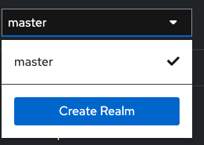
3. Name the realm "root" -> it will be our standalone realm for food delivery only
    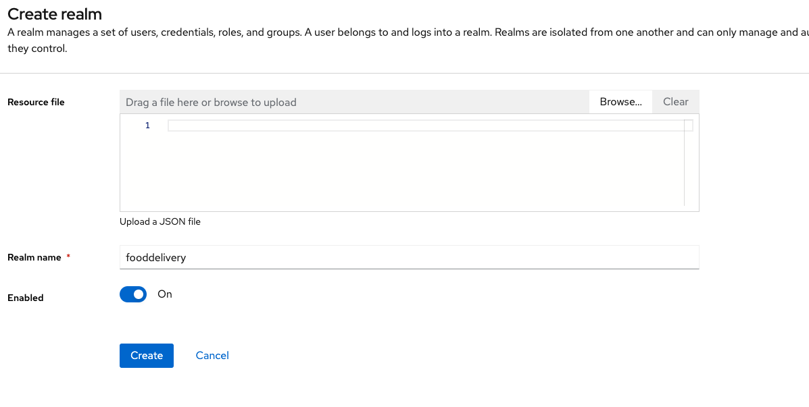
4. Select our new realm, go to the client tab
    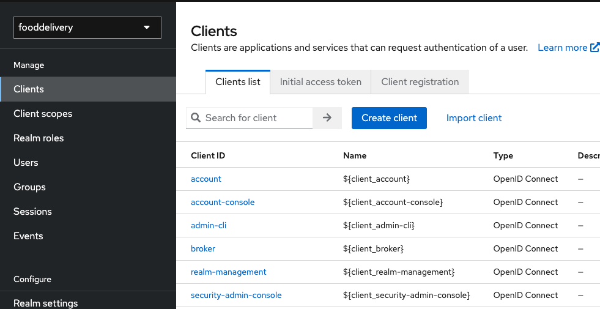
5. Click create client
6. In general step, fill fields, name and id should have name "fooddelivery"
   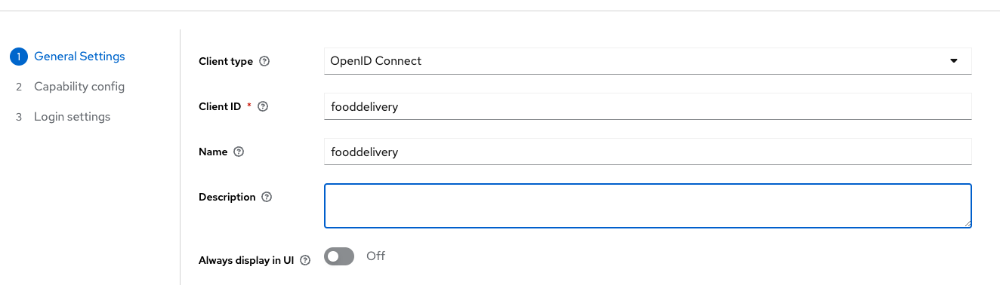
7. Capability config - apply all rules
   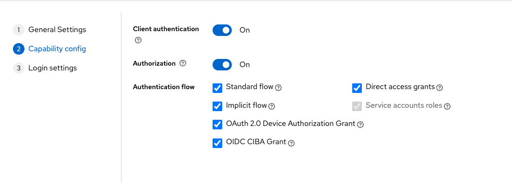
8. We need to fill Login settings correctly:
   1. Root URL - is always http://localhost:8081
   2. Home URL - is http://localhost:8081, where order system is placed
   3. Valid redirect URIs is list of localhost from 8080 to 8082 ports and for same ports system's hostnames
   4. Valid post logout redirect URIs we won't touch
   5. Web origins - permit all, so value is "+"
   6. Result:<br/>
       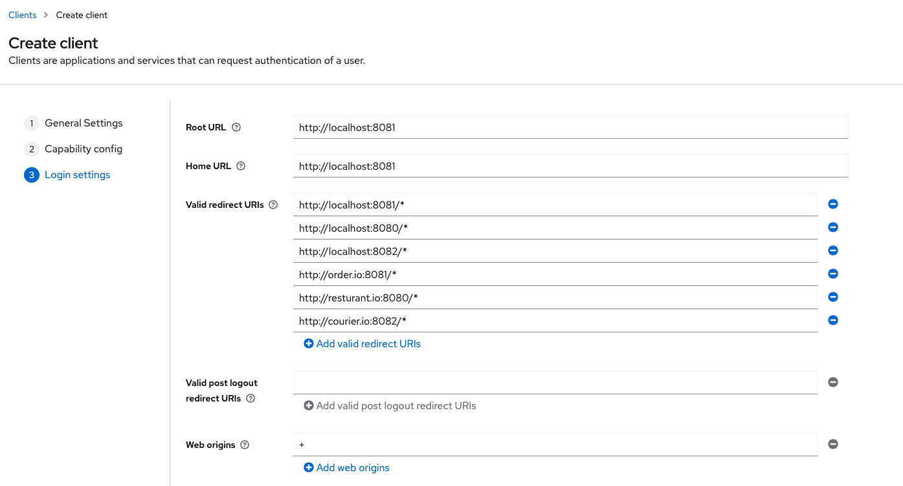
9. Add **realm role** named "system-full-access"<br/>
    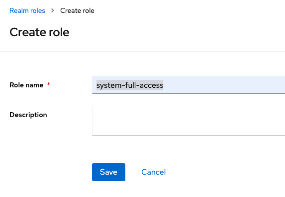
10. Add realm **client-scope**:<br/>
    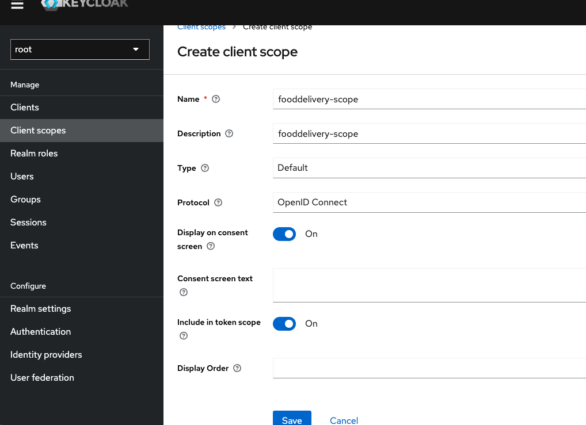
11. Add scope **mapper** for created **client-scope**:
    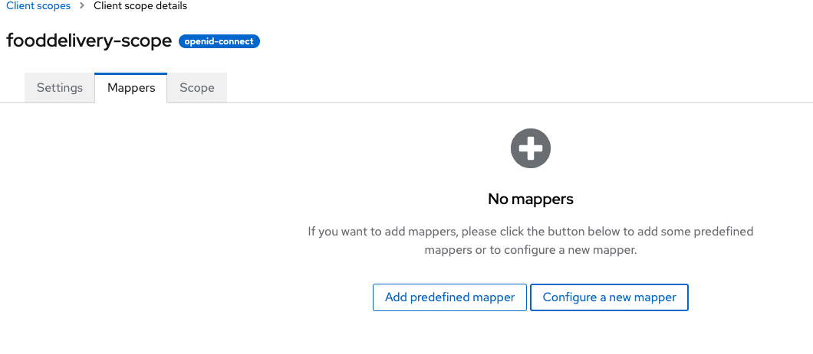
12. Select "create configured mapper", select "user realm role"
    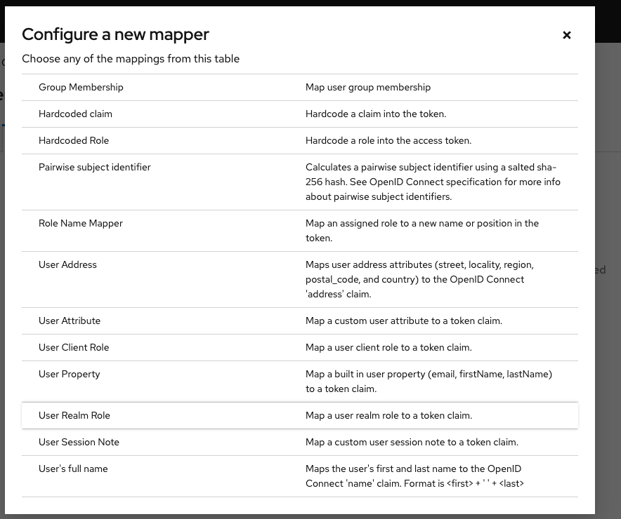
13. Fill realm role mapper fields, name it "realm-role" and set claim name "realm role". 
    Claim name will apply additional "claim-key" with same name that contains all realm roles inside JWT token:
    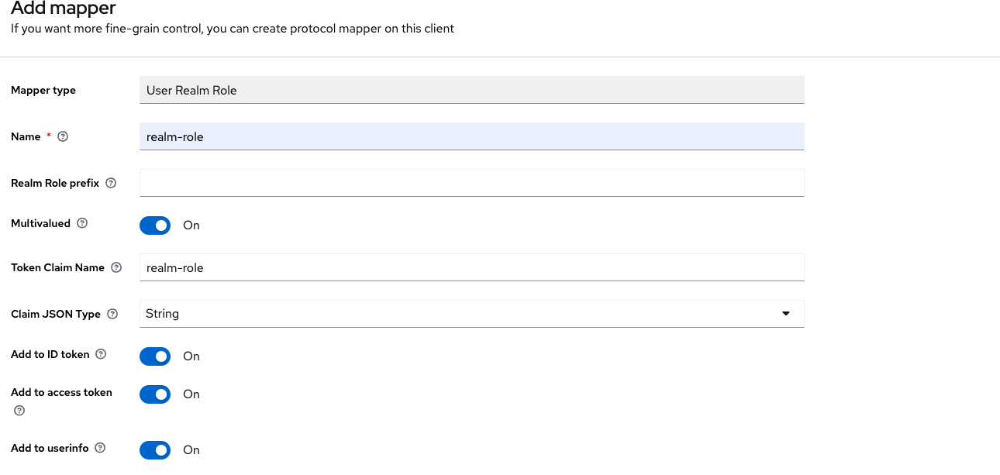
14. Go back to the created client "fooddelivery", tab "client scopes", click "Add client scope"
    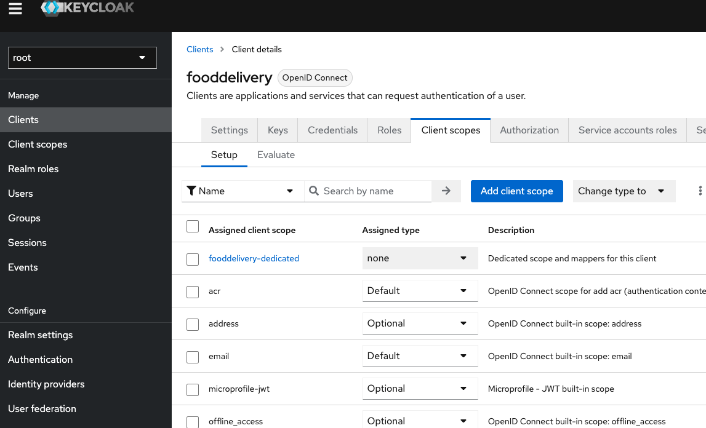
15. Add our client-scope as default. In the list you should see our client scope.
    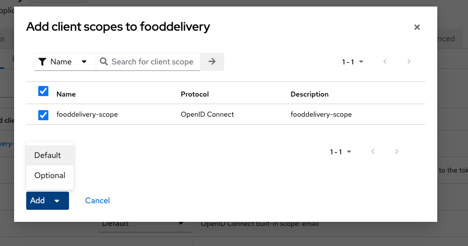
16. At last. Create user, fill it as you want.
    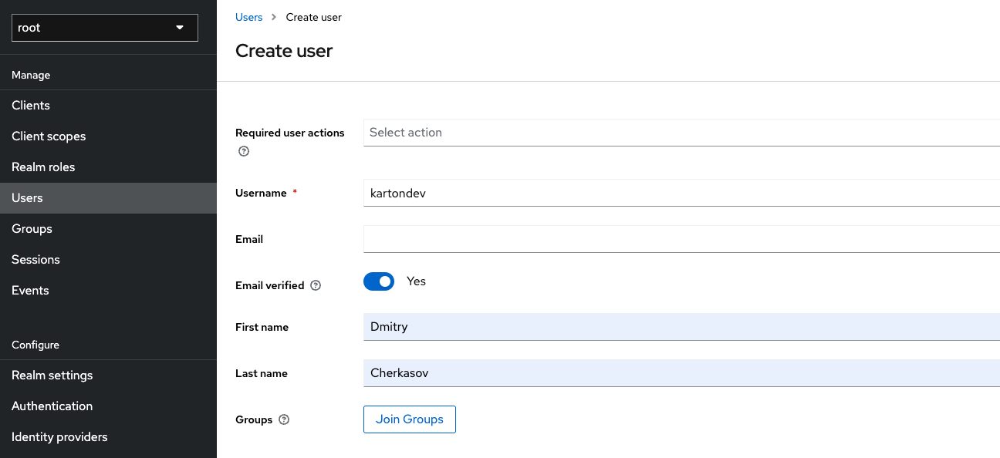
17. Change credential for this user.
    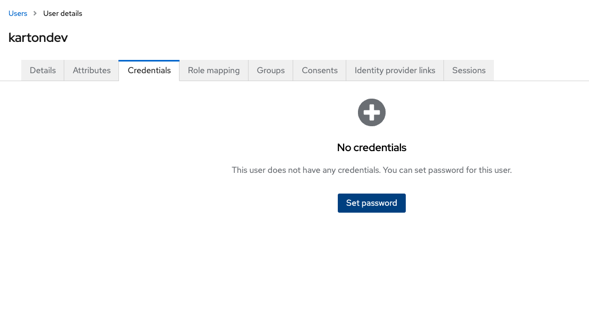
18. Go to the tab "Role mapping", assign "system-full-access"
    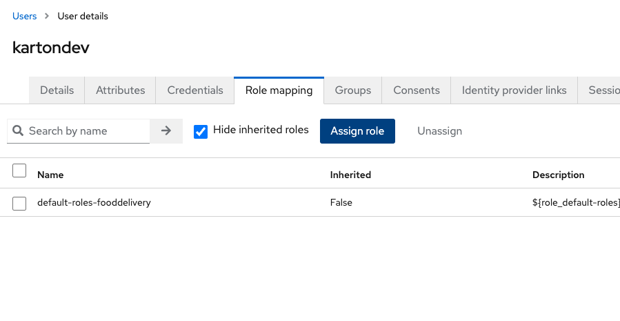<br/>
    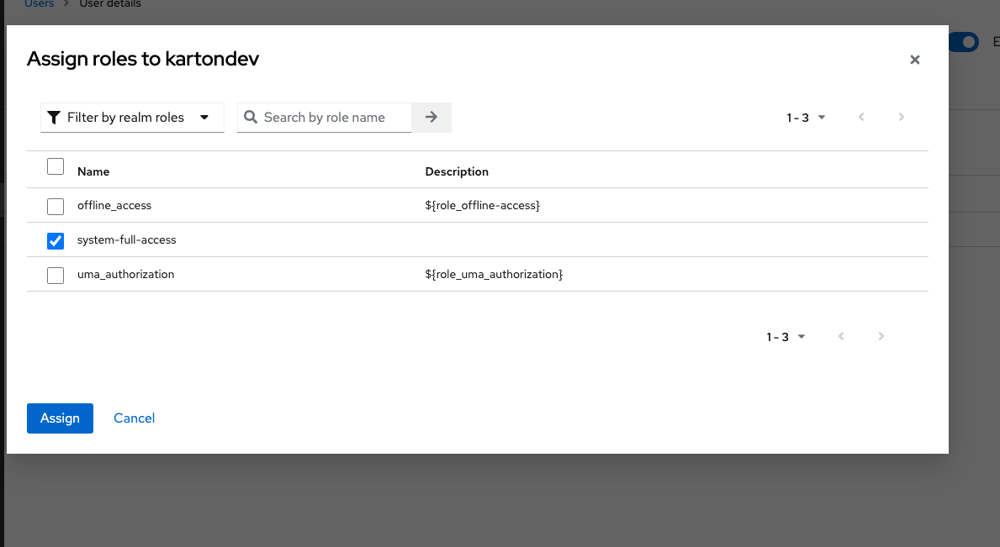
19. Configuration almost done. Just don't forget your password for created user ;)


### Import tokens from Keycloak into the application properties for each standalone systems

To finally configure Keycloak we need to import client "fooddelivery"'s secret token into application properties:

1. copy client secret
2. paste it into each application properties key:
    ```properties
    spring.security.oauth2.client.registration.keycloak.client-secret=YOUR SECRET PASTE HERE
    ```
   
### Run application and test it
1. Run application (any of the systems to prove that all fine)
2. As, for me, i ran OrderSystem, so I am going to http://order.io:8081, seeing login form by keycloak and login-ing:
   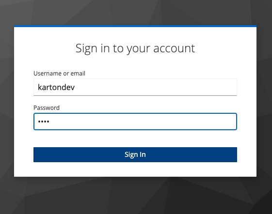
3. If you did all right, you will login and see our application main page
   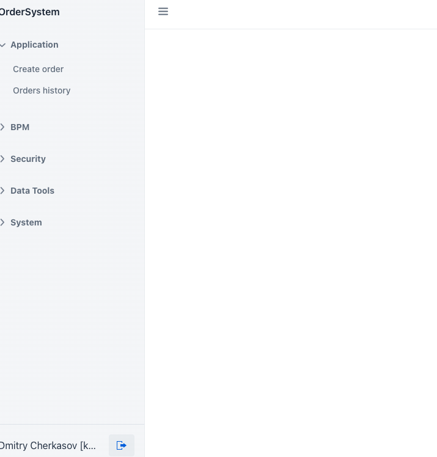
4. Done. Now you can run all applications and play with **Food Delivery Demo Application**


## Food delivery and restaurant management

To start demo-delivering, we also need to do some pre-settings:
1. Go to the restaurant system
2. As admin, allocate new restaurants for management
3. Go to restaurants and select any of the list
4. Fill a restaurant by its menu
5. When all restaurants are configured, we can start delivering


## Delivery steps (for local development)
1. Go to the Delivery System at **delivery.io** or **delivery.io:8081** (depends on your host settings)
2. Go to the 