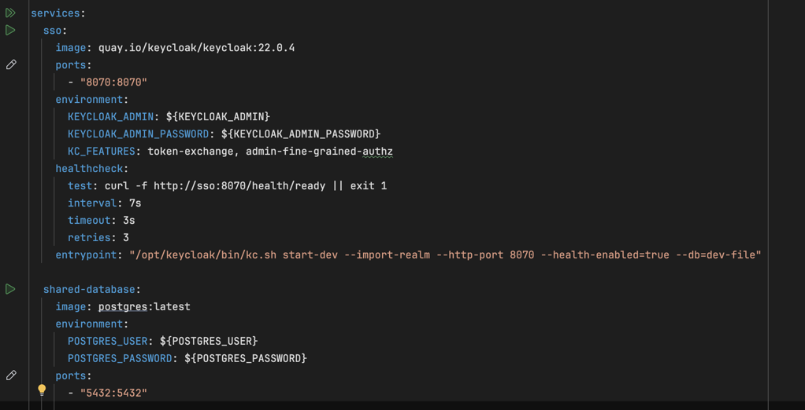

# Food Delivery Jmix


## Setup (for local development)

To run FoodDelivery application, you should do several steps:
1. Local infrastructure
2. Configuring Keycloak
3. Import tokens from Keycloak into the application properties for each standalone systems
4. Deploy database and also configure all application properties
5. Setup hosts for application urls and hosts
6. Run application

### Local infrastructure
First, you need to start docker to deploy Postgres and Keycloak locally. Therefore, you have to options:
* Run docker compose from console
    ```shell
    docker-compose --project-directory FoodDelivery-all up
    ```
* Alternatively, if you are using IDEA Ultimate, you can open `docker-compose.yml` file and run it by clicking "run" button on the left side:


Now all our local infrastructure is deployed.

### Configuring Keycloak

## Food delivery and restaurant management

To start demo-delivering, we also need to do some pre-settings:
1. Go to the restaurant system
2. As admin, allocate new restaurants for management
3. Go to restaurants and select any of the list
4. Fill a restaurant by its menu
5. When all restaurants are configured, we can start delivering


## Delivery steps (for local development)
1. Go to the Delivery System at **delivery.io** or **delivery.io:8081** (depends on your host settings)
2. Go to the 