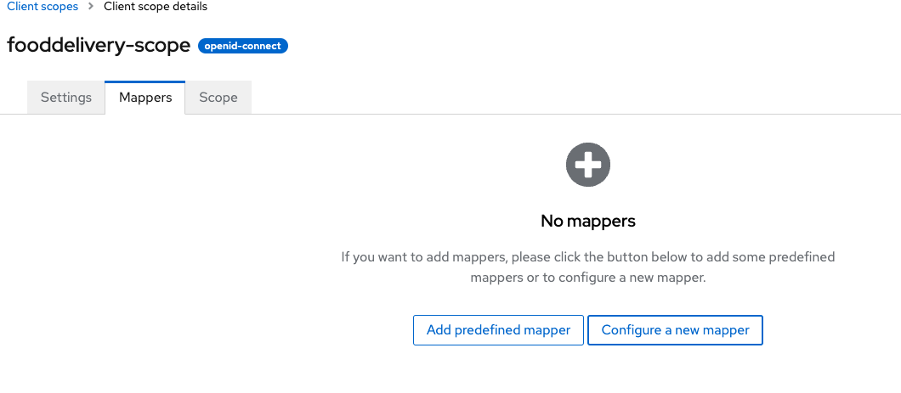
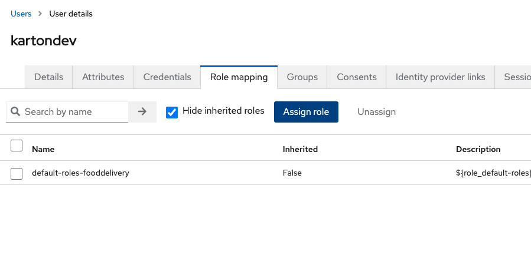

# Food Delivery Local Development Setup Guide

Welcome to the setup guide for the Food Delivery application. We'll walk you through the process of 
setting up a local development environment using Docker for easy infrastructure management.

## Steps to Run Food Delivery Locally:
1. Local infrastructure
2. Setup hosts for application urls and hosts
3. Configuring Keycloak
4. Import tokens from Keycloak into the application properties for each standalone systems
5. Run application

## Setting Up Local Infrastructure

Before running the Food Delivery application, you need to deploy Postgres and Keycloak locally using Docker. You have two options for this:

* **Option 1**: Run Docker Compose from the console:
    ```shell
    docker-compose --project-directory FoodDelivery-all up
    ```

* **Option 2**: If you're using IntelliJ IDEA Ultimate, open the `docker-compose.yml` file and click the "run" button on the left side.

  

With either option, you'll have all the necessary infrastructure deployed locally and ready for use.

## Configuring Host Names

To ensure smooth operation of the Food Delivery application, we need to configure hostnames for the three systems running on different ports locally:

1. **Restaurant System** (port 8080)
2. **Order System** (port 8081)
3. **Courier System** (port 8082)

### Option 1: Define Separate Hostnames

Due to limitations within Vaadin when using multiple applications on one hostname, we'll assign separate hostnames to each system on the same local host (127.0.0.1).

Add the following entries to your hosts file:

```text
    127.0.0.1	localhost
    255.255.255.255	broadcasthost
    ::1             localhost
    127.0.0.1       order.io
    127.0.0.1       restaurant.io
    127.0.0.1       courier.io
```

### Option 2: Proxy Hosts (Alternative Solution)

If you prefer not to use port numbers in the hostnames (e.g., "courier.io:8081", "restaurant.io:8080"), you can follow this alternative solution:

1. Allocate local IPs for host names for each system:

    ```text
        127.0.0.1	localhost
        255.255.255.255	broadcasthost
        ::1             localhost
       
        # Example IP allocations (replace with actual IPs)
        156.28.12.56    order.io 
        182.11.244.12   restaurant.io
        143.192.11.12   courier.io
    ```

2. Proxy all systems from the local host with ports into the selected IPs. 
   The specific commands for this vary depending on your operating system.

    ```text
        # Pseudo-proxy setting
        127.0.0.1:8081 -> 182.11.244.12    # order system local IP
        127.0.0.1:8080 -> 156.28.12.56     # restaurant system local IP
        127.0.0.1:8082 -> 143.192.11.12    # courier system local IP
    ```

3. Utilize the mapped hostnames:

    ```text
        order.io      -> 127.0.0.1:8081 (order system)
        restaurant.io -> 127.0.0.1:8080 (restaurant system)
        courier.io    -> 127.0.0.1:8082 (courier system)
    ```

Choose the option that best suits your preferences and environment for seamless 
operation of the Food Delivery application.

## Local Development

Before running the applications, it's important to remember that certain systems rely on specific modules. 
Ensure smooth development by publishing add-ons into the local Maven repository.

## Configuring Keycloak

To set up Keycloak for the Food Delivery application, follow these manual configuration steps:

1. Access Keycloak at http://localhost:8070 using the credentials admin-admin.
2. On the left side of the admin bar, navigate to the list of realms and create a new realm.<br/>
   <br/>
3. Name the realm "root" as it will serve as our standalone realm for Food Delivery.<br/>
   <br/>
4. Select the newly created realm and navigate to the "Clients" tab.<br/>
   <br/>
5. Click "Create Client".
6. In the general settings, fill in the fields with the name and ID as "fooddelivery".<br/>
   <br/>
7. Configure capabilities by applying all rules.<br/>
   <br/>
8. Configure Login settings:
    - Root URL: Always http://localhost:8081
    - Home URL: http://localhost:8081, where the order system is placed.
    - Valid redirect URIs: List all localhost addresses from ports 8080 to 8082 and the respective system hostnames.
    - Leave Valid post logout redirect URIs unchanged.
    - Permit all Web origins by setting the value as "+".<br/>

   <br/>
   
9. Add a **realm role** named "system-full-access".<br/>
   <br/>
10. Add a realm **client-scope**.<br/>
    <br/>
11. Add a scope **mapper** for the created **client-scope**.<br/>
    <br/>
12. Select "create configured mapper" and choose "user realm role".<br/>
    <br/>
13. Fill in the realm role mapper fields, naming it "realm-role", and set the claim name as "realm role".
    This will apply an additional "claim-key" with the same name containing all realm roles inside the JWT token.<br/>
    <br/>
14. Go back to the created client "fooddelivery", navigate to the "Client Scopes" tab, and click "Add client scope".<br/>
    <br/>
15. Add our client-scope as default. You should see our client scope in the list.<br/>
    <br/>
16. Finally, create a user and fill in the details as desired.<br/>
    <br/>
17. Change the password for this user.<br/>
    <br/>
18. Navigate to the "Role mapping" tab and assign "system-full-access" to the user.<br/>
    <br/>
    
    <br/>
Your configuration is nearly complete.
    Just remember the password for the created user.
    Now, Keycloak is set up for use with the Food Delivery application.


## Importing Client Secret and Testing

To complete the Keycloak configuration, you need to import the client secret for the "fooddelivery" client into the application properties. Follow these steps:


1. Copy the client secret.
2. Paste it into each application properties file using the following key:

    ```properties
    spring.security.oauth2.client.registration.keycloak.client-secret=YOUR_SECRET_PASTE_HERE
    ```

### Running and Testing the Application

1. Run any of the systems (e.g., Restaurant, Order, Courier) to ensure everything is functioning correctly.
2. For example, if you're testing the Order System, navigate to http://order.io:8081 in your web browser.<br/>
   <br/>
3. You should see the Keycloak login form. Log in using your credentials.<br/>
   <br/>
4. If everything is configured correctly, you will be logged in and redirected to the main page of the application.
5. Congratulations! You can now run all applications and explore the **Food Delivery Demo Application**.

With the client secret imported and the application successfully tested, 
you're ready to use Keycloak with the Food Delivery application. Enjoy exploring the demo!

