# Leveraging Food Delivery Features

To make the most of the features offered by the Food Delivery application, it's important to follow these steps after completing the initial setup. If you haven't set up the application yet, please refer to [the guidelines provided here](../project-configuration/README.md).

## Essential Steps

1. **Configure Restaurants:** Setting up restaurants is the first crucial step before starting any deliveries. 
This involves creating profiles for each restaurant and configuring their menu items. 
Users with system-wide access will manage these tasks as if they were restaurant administrators.

2. **Understand Courier Role:** Users with system-wide access will seamlessly transition into the role of a courier when they log in. 
There's no separate setup required for the Courier System.

3. **Initiate Delivery Process:** Starting the delivery process requires users to fulfill multiple roles within the system, 
including client, restaurant administrator, and courier. 
This holistic approach ensures a smooth and efficient delivery experience for all parties involved.

4. Keep in mind that the system only has one role - system full access. 
Therefore, you'll need to simulate being a client, a restaurant administrator, and a courier to fully engage with the functionality

## Before all steps
Before proceeding with any of the steps, ensure that all systems are running simultaneously. Familiarize yourself with their local addresses, 
such as http://restaurants.io for the Restaurant System, to seamlessly navigate between them during the process.

## Setting Up the Restaurant

1. **Login to the Restaurant System:** Access the Restaurant System by visiting http://restaurant.io:8080 or http://restaurant.io.
2. **Navigate to the Administrative View:** Once logged in, go to the "Restaurants" tab. This is the administrative view specifically designed for the Restaurant System Administrator, distinct from the regular "Restaurant Administrator" view.
3. **Create a New Restaurant:** Fill out the form to create a new restaurant, ensuring to designate yourself as the owner. 
   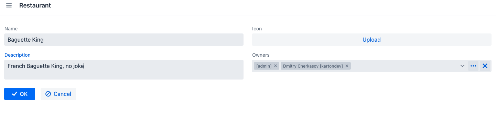 
4. **Select Your Restaurant:** After creating the restaurant, go to the "My Restaurants" tab and choose the one you just created. 
   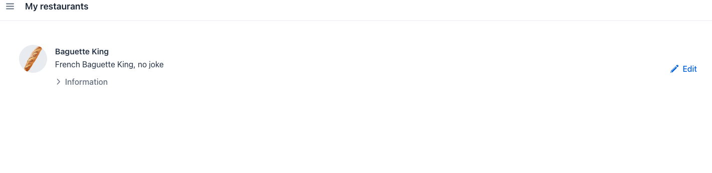 
5. **Edit Restaurant Details:** Make any necessary edits to the restaurant details as desired. 
   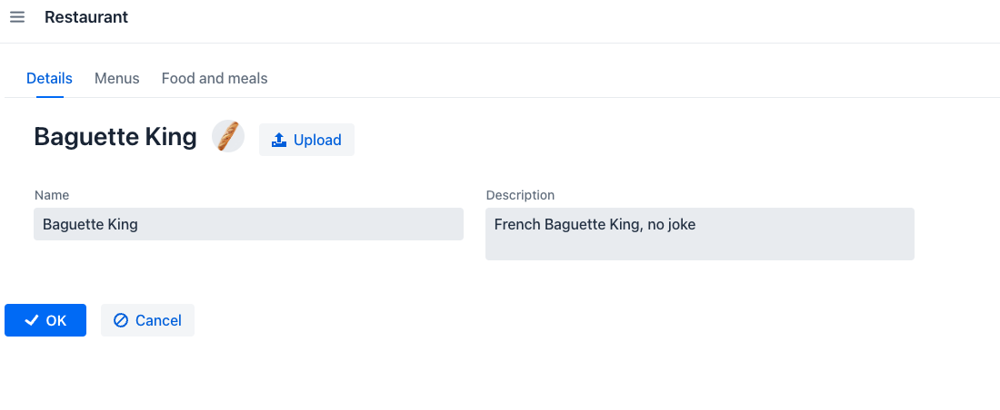 
6. **Add Food Items:** Navigate to the "Food and Meals" tab and add food items for the restaurant. 
   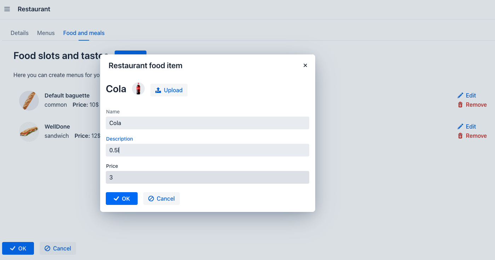 
7. **Set Up the Restaurant's Menu:** Configure the restaurant's menu, which dictates how users will view the restaurant. 
    Note that menu names will be displayed as meal tabs for users. 
   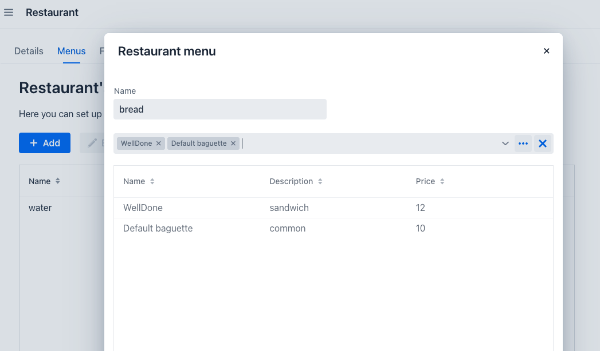 
8. **Ready for Delivery Processing:** With the restaurant system fully set up, it's now prepared for processing deliveries.

## Placing an Order from Restaurants

1. **Access the Order System:** Visit the Order System at http://order.io.
2. **Create a New Order:** Click on the "Create Order" menu tab to initiate a new order.
3. **Select the Desired Restaurant:** Choose the restaurant from which you want to order. 
   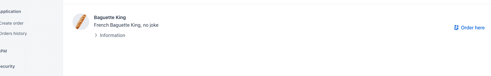 
4. **Place Your Order:** Select your desired items and proceed to approve the order. 
   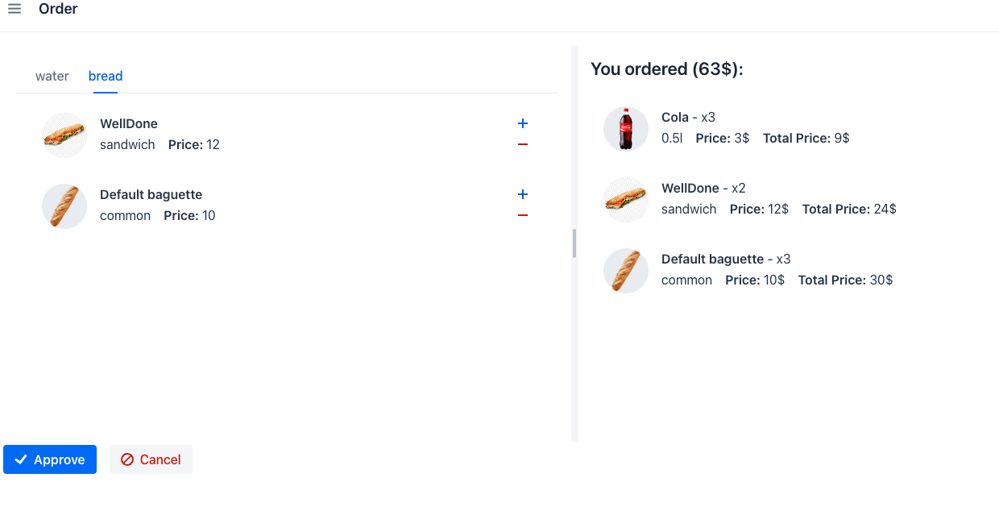 
5. **Check Order Status:** Navigate to the "Order History" tab to confirm that your order is in the "New" status. 
   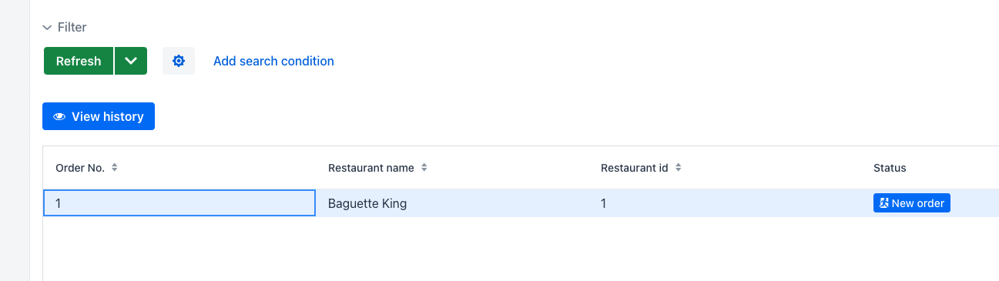 
6. **Monitor Progress:** Refresh the list to see the status change to "Wait for Restaurant." 
   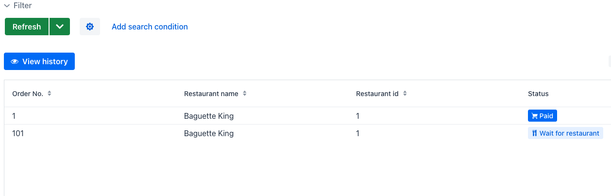 
7. **Switch to Restaurant Administrator Role:** Head to the Restaurant System to assume the role of a restaurant administrator.
8. **Handle Cooking Requests:** Access the "Cook Requests" section to view and approve cooking requests. 
   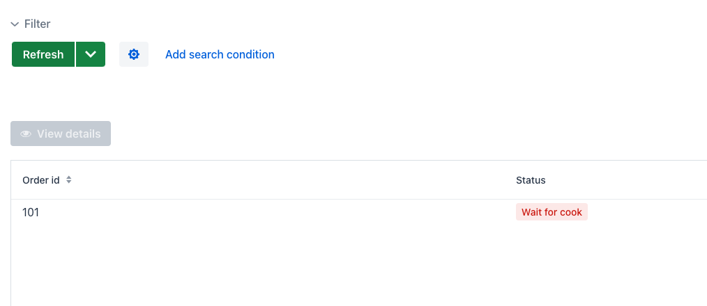 
9. **Approve Cooking Request:** Open the new request and approve it. 
   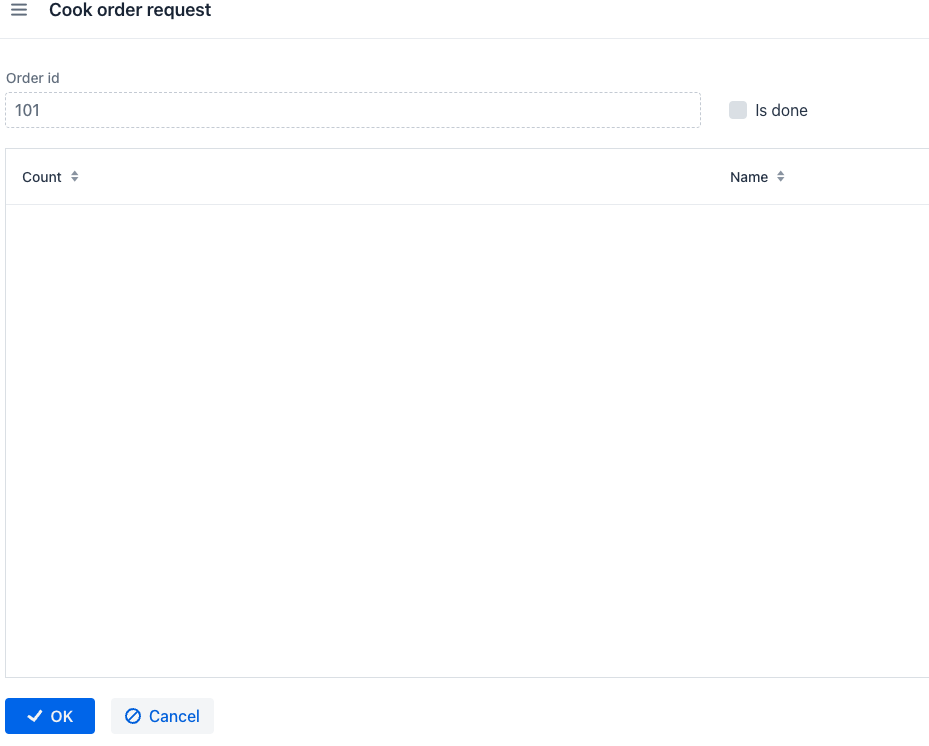 
10. **Return to Order System:** Go back to the Order System and check the order status, which should now be "Wait for Cooking." 
    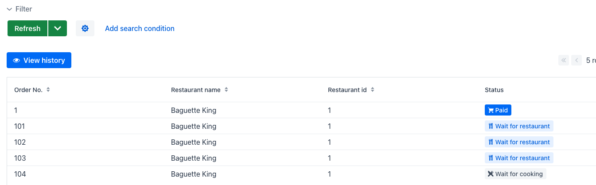 
11. **Continue Monitoring:** Refresh the list to see the status change to "Finding Courier." 
    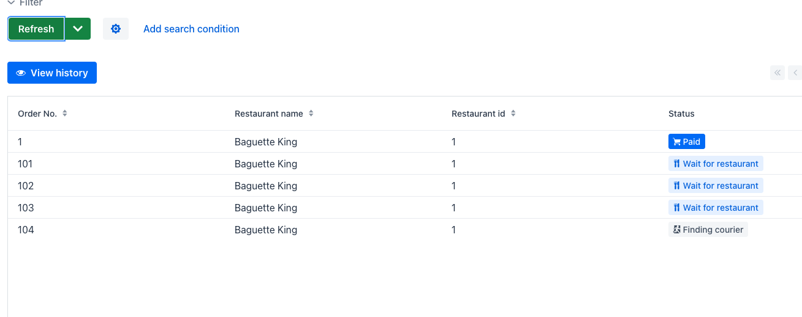 
12. **Transition to Courier Role:** Switch to the Courier System to act as a courier.
13. **Handle Delivery Requests:** Access the delivery requests tab and assign the delivery to yourself. 
    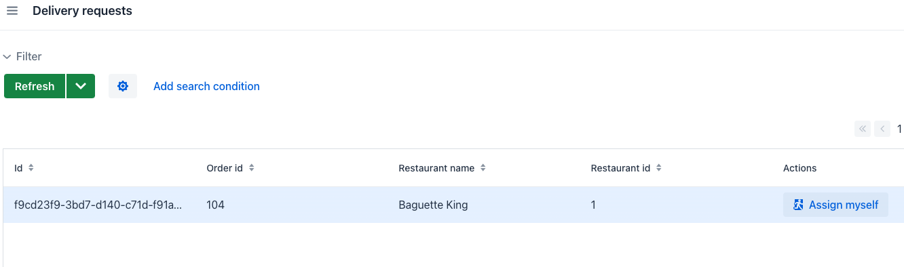 
14. **Begin Delivery:** Mark the order as "delivering."
15. **Track Delivery Progress:** Return to the Order System and refresh the orders list to see the status as "delivering." 
    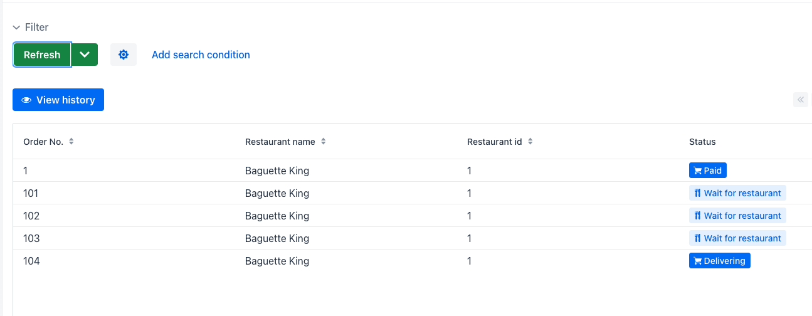 
16. **Monitor Delivery:** Go back to the Courier System and navigate to the "My Delivery" tab to see your delivery request.
17. **Mark Order as Delivered:** Click "mark delivered" when the order is successfully delivered. 
    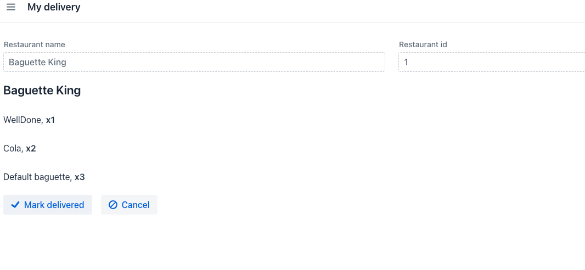 
18. **Finalize Delivery:** Return to the Order System once more.
19. **Confirm Order Completion:** Refresh your order list to ensure the status has changed to "Done." 
    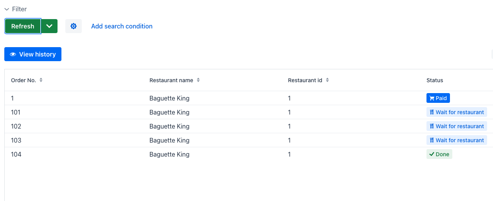 
20. **Delivery Process Complete:** With the order successfully delivered and the business process concluded, 
you've completed all necessary steps. All done!

Congratulations! The delivery process and order have been successfully completed, 
marking the culmination of the business process. All tasks are now finalized.

